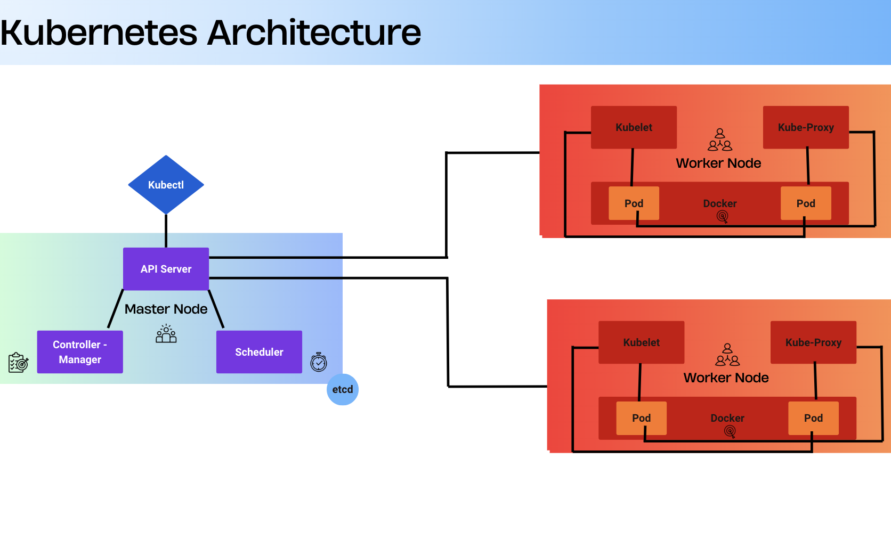
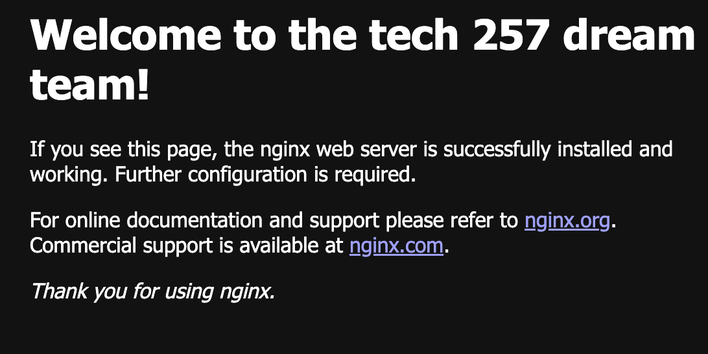
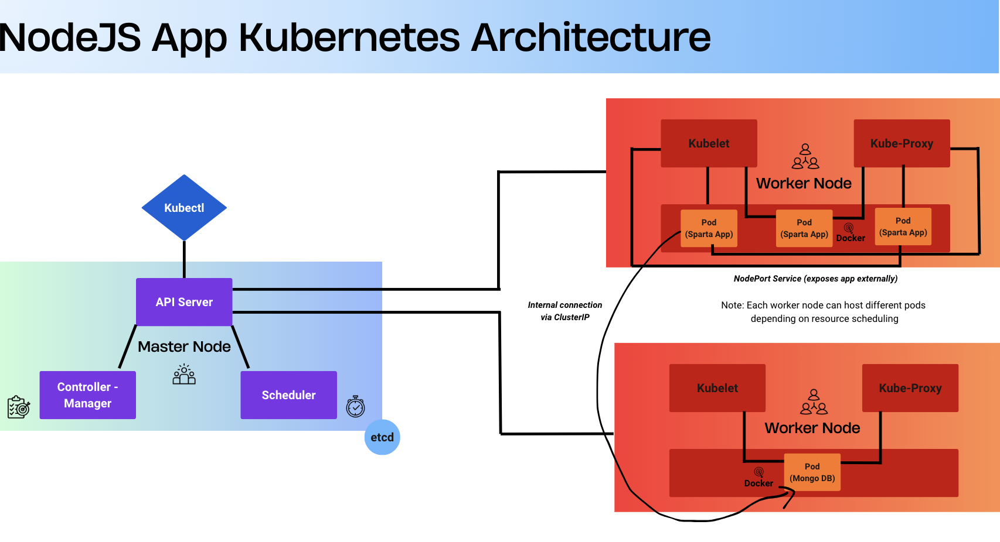
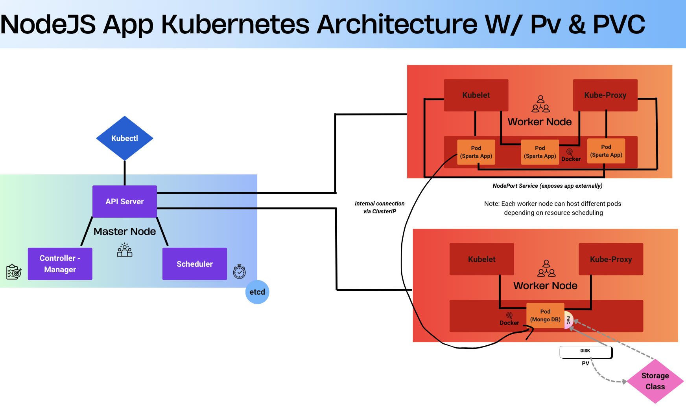
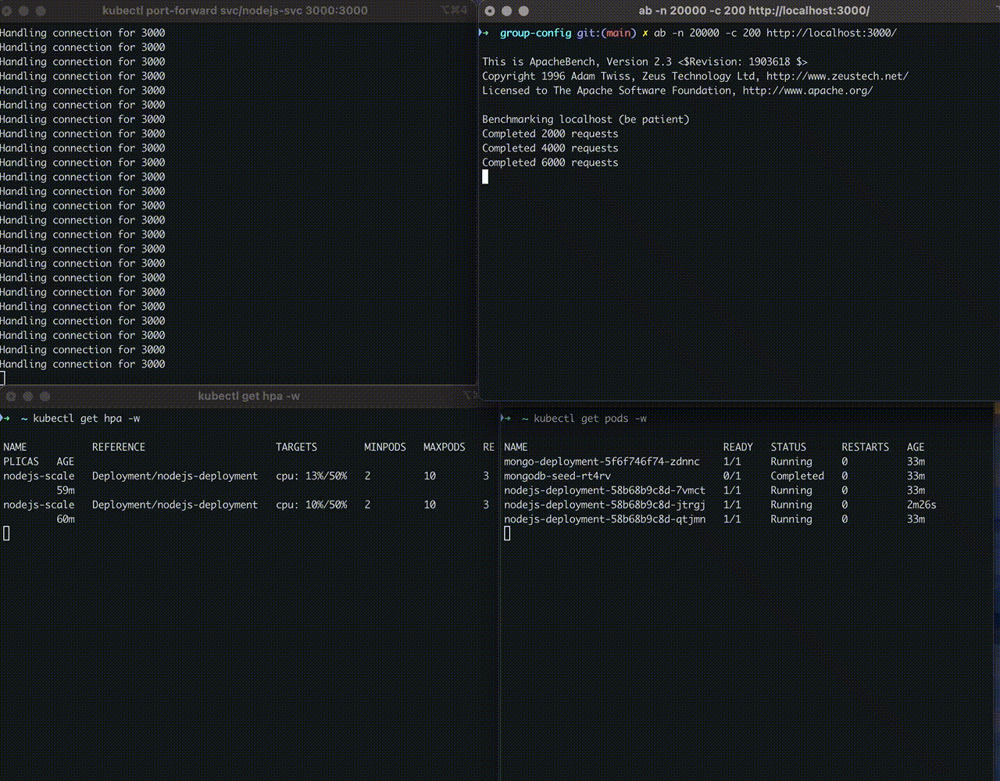

- [Kubernetes Basics](#kubernetes-basics)
  - [Why Kubernetes is Needed](#why-kubernetes-is-needed)
  - [What Kubernetes Does](#what-kubernetes-does)
    - [What Kubernetes Is Not](#what-kubernetes-is-not)
  - [Benefits of Kubernetes](#benefits-of-kubernetes)
  - [Success Story: Booking.com](#success-story-bookingcom)
    - [Challenge](#challenge)
    - [Solution](#solution)
    - [Impact](#impact)
  - [Kubernetes Architecture](#kubernetes-architecture)
    - [Control Plane Components](#control-plane-components)
    - [Node Components](#node-components)
  - [Pros and Cons of Using a Managed Service vs Launching Your Own](#pros-and-cons-of-using-a-managed-service-vs-launching-your-own)
    - [Control Plane vs Data Plane](#control-plane-vs-data-plane)
  - [Kubernetes Objects](#kubernetes-objects)
    - [Types of Kubernetes Objects](#types-of-kubernetes-objects)
      - [Ephemeral Pods](#ephemeral-pods)
    - [How to Mitigate Security Concerns with Containers](#how-to-mitigate-security-concerns-with-containers)
    - [Maintained Images](#maintained-images)
      - [Pros](#pros)
      - [Cons](#cons)
  - [Installing Kubernetes with Docker Desktop](#installing-kubernetes-with-docker-desktop)
  - [Kubernetes Resource Definitions: Services, Deployments, and Jobs](#kubernetes-resource-definitions-services-deployments-and-jobs)
    - [Deployment](#deployment)
    - [Service](#service)
    - [Job](#job)
  - [Creating a Kubernetes Deployment](#creating-a-kubernetes-deployment)
    - [Applying the Deployment - Nginx](#applying-the-deployment---nginx)
    - [Viewing Deployment Details](#viewing-deployment-details)
  - [Getting a NodePort Service Running](#getting-a-nodeport-service-running)
    - [Creating the Service](#creating-the-service)
    - [Viewing Service Details](#viewing-service-details)
    - [Accessing the Application](#accessing-the-application)
    - [Why NodePort Access May Not Work on Some Systems](#why-nodeport-access-may-not-work-on-some-systems)
  - [Deleting a Pod](#deleting-a-pod)
    - [Why Kubernetes Pods Respawn After Deletion](#why-kubernetes-pods-respawn-after-deletion)
  - [Increasing Replicas with No Downtime](#increasing-replicas-with-no-downtime)
    - [Method 1 - Edit the Deployment File in Real-time](#method-1---edit-the-deployment-file-in-real-time)
    - [Method 2 - Apply a Modified Deployment File](#method-2---apply-a-modified-deployment-file)
    - [Method 3 - Use the Scale Command](#method-3---use-the-scale-command)
- [Node.js 20 Application – Kubernetes Deployment Documentation](#nodejs-20-application--kubernetes-deployment-documentation)
  - [Overview](#overview)
  - [Deployment Workflow](#deployment-workflow)
  - [File Purposes](#file-purposes)
    - [1. mongo-deploy.yml](#1-mongo-deployyml)
    - [2. mongo-service.yml](#2-mongo-serviceyml)
    - [3. node-deploy.yml](#3-node-deployyml)
    - [4. node-service.yml](#4-node-serviceyml)
    - [5. seed-job.yml](#5-seed-jobyml)
  - [Environment Variable Configuration](#environment-variable-configuration)
  - [Seed Job Breakdown](#seed-job-breakdown)
  - [Introduction to Managing Storage in Kubernetes](#introduction-to-managing-storage-in-kubernetes)
  - [Mongo VP and VPC Configuration](#mongo-vp-and-vpc-configuration)
    - [Updates to Mongo Deployment](#updates-to-mongo-deployment)
  - [MongoDB Deploy: Storage Change](#mongodb-deploy-storage-change)
    - [Memory Allocation](#memory-allocation)
    - [Sparta App Architecture with PV and PVC](#sparta-app-architecture-with-pv-and-pvc)
  - [However, for production environments or scenarios where MongoDB replicas and stable pod identities are required, MongoDB should be deployed using a **StatefulSet** instead. StatefulSets provide consistent network identities and ensure that `PersistentVolumeClaims` remain reliably attached to the correct Pod across rescheduling and scaling.](#however-for-production-environments-or-scenarios-where-mongodb-replicas-and-stable-pod-identities-are-required-mongodb-should-be-deployed-using-a-statefulset-instead-statefulsets-provide-consistent-network-identities-and-ensure-that-persistentvolumeclaims-remain-reliably-attached-to-the-correct-pod-across-rescheduling-and-scaling)
    - [Recommended File Grouping](#recommended-file-grouping)
    - [Dependency and Apply Order](#dependency-and-apply-order)
    - [Verifying PersistentVolume and PersistentVolumeClaim](#verifying-persistentvolume-and-persistentvolumeclaim)
    - [Validating Persistence](#validating-persistence)
    - [Deleting a PVC (Best Practice)](#deleting-a-pvc-best-practice)
      - [Deleting the PVC and Handling Finalizers](#deleting-the-pvc-and-handling-finalizers)
    - [Deleting a PV](#deleting-a-pv)
    - [Data Persistence](#data-persistence)
      - [PersistentVolume Reclaim Policy](#persistentvolume-reclaim-policy)
      - [HostPath Location and Persistence Characteristics](#hostpath-location-and-persistence-characteristics)
      - [StorageClassName](#storageclassname)
  - [Autoscaling Workloads](#autoscaling-workloads)
  - [Autoscaling Workloads](#autoscaling-workloads-1)
    - [Horizontal Scaling (HPA)](#horizontal-scaling-hpa)
    - [Vertical Scaling (VPA)](#vertical-scaling-vpa)
  - [Metrics Server on Docker Desktop](#metrics-server-on-docker-desktop)
    - [Installation of Metric Server](#installation-of-metric-server)
    - [Stress Testing On the Node.js Application on Docker Desktop](#stress-testing-on-the-nodejs-application-on-docker-desktop)
  - [Docker Desktop Alternative](#docker-desktop-alternative)
    - [Stress Testing On the Node.js Application on Minikube](#stress-testing-on-the-nodejs-application-on-minikube)
    - [Switching Between Docker Desktop and Minikube Kubernetes Contexts](#switching-between-docker-desktop-and-minikube-kubernetes-contexts)
- [Deploying Multiple Applications on Minikube in an EC2 Environment](#deploying-multiple-applications-on-minikube-in-an-ec2-environment)
  - [EC2 Instance Setup](#ec2-instance-setup)
  - [Installing Docker](#installing-docker)
  - [Installing kubectl](#installing-kubectl)
  - [What is Minikube](#what-is-minikube)
  - [Installing and Starting Minikube](#installing-and-starting-minikube)
  - [Installing NGINX on the EC2 Host](#installing-nginx-on-the-ec2-host)
  - [First Application: NodePort Exposure on Port 30001](#first-application-nodeport-exposure-on-port-30001)
    - [Reverse Proxy for Application 1](#reverse-proxy-for-application-1)
    - [Security Group Changes for Application 1:](#security-group-changes-for-application-1)
    - [Troubleshooting Notes](#troubleshooting-notes)
  - [Second Application Deployment (LoadBalancer + Reverse Proxy)](#second-application-deployment-loadbalancer--reverse-proxy)
    - [Why a LoadBalancer Service is Used](#why-a-loadbalancer-service-is-used)
    - [What `minikube tunnel` Does](#what-minikube-tunnel-does)
    - [Security Group Changes for Application 2:](#security-group-changes-for-application-2)
    - [NGINX Reverse Proxy Configuration](#nginx-reverse-proxy-configuration)
    - [NodePort vs LoadBalancer Summary](#nodeport-vs-loadbalancer-summary)
    - [Verifying the LoadBalancer Assignment](#verifying-the-loadbalancer-assignment)
  - [Third Application Deployment (hello-minikube) Within the Multi-Application Setup](#third-application-deployment-hello-minikube-within-the-multi-application-setup)
    - [Purpose of Using the hello-minikube App](#purpose-of-using-the-hello-minikube-app)
    - [Deployment and Exposure](#deployment-and-exposure)
    - [Integrating Into the Existing NGINX Reverse Proxy](#integrating-into-the-existing-nginx-reverse-proxy)
  - [Cleanup](#cleanup)
  - [General Cleanup Procedure (All Applications)](#general-cleanup-procedure-all-applications)
  - [Restoring Kubernetes After EC2 Reboot](#restoring-kubernetes-after-ec2-reboot)

# Kubernetes Basics

## Why Kubernetes is Needed

Containers make it easy to package and run applications consistently across environments. In production, they must be monitored, updated, and replaced automatically to prevent downtime. Managing this manually can become complex and unreliable.  

Kubernetes is an **open-source container orchestration platform** that automates these operational tasks. It provides a framework for running distributed systems reliably, handling scaling, failover, and deployment strategies such as *canary releases* (where a new version is rolled out to a small subset of users before full deployment).

## What Kubernetes Does

**Kubernetes provides:**

- **Service Discovery and Load Balancing**  
  Exposes containers through DNS names or IP addresses and distributes traffic evenly to maintain performance and stability.

- **Storage Orchestration**  
  Mounts storage systems such as local disks, network storage, or cloud providers, allowing data to persist even when containers restart.

- **Automated Rollouts and Rollbacks**  
  Updates applications gradually by replacing old containers with new ones and rolls back automatically if issues occur.

- **Automatic Bin Packing**  
  Schedules containers efficiently across nodes based on CPU and memory requirements to maximise resource use.

- **Self-Healing**  
  Monitors container health and automatically restarts, replaces, or removes failed or unresponsive containers until they are ready to serve traffic.

- **Secret and Configuration Management**  
  Manages sensitive data such as passwords, tokens, and SSH keys securely, allowing updates without rebuilding container images.

- **Batch Execution**  
  Runs batch and CI workloads, automatically rescheduling containers if they fail to ensure jobs complete reliably.

- **Horizontal Scaling**  
  Scales applications up or down manually, via a dashboard, or automatically based on CPU or memory metrics.

- **IPv4/IPv6 Dual-Stack Support**  
  Assigns both IPv4 and IPv6 addresses to Pods and Services for flexible networking.

- **Designed for Extensibility**  
  Supports plug-ins and extensions to add functionality without modifying Kubernetes’ core codebase.

---

### What Kubernetes Is Not

Kubernetes is **not** a traditional all-in-one Platform as a Service (PaaS).  

It operates at the container level rather than the hardware level, offering deployment, scaling, and load balancing while remaining modular. Logging, monitoring, and alerting tools can be integrated as needed.  

Kubernetes provides the building blocks for developer platforms while maintaining flexibility and user choice.

---

## Benefits of Kubernetes

Kubernetes offers clear technical and operational advantages for managing containerised applications efficiently across any environment.

**Container orchestration savings**  
Automates container placement and resource management, reducing manual maintenance and downtime. Efficient scheduling means fewer servers, lower management costs, and less administrative overhead. Once clusters are configured, applications run reliably with minimal intervention.

**Increased DevOps efficiency for microservices**  
Simplifies development and deployment in microservices architectures. Containers make building, testing, and releasing faster than with virtual machines. Smaller teams can focus on individual services, improving collaboration and release speed. Namespaces provide structure and access control within clusters.

**Multicloud workload deployment**  
Supports consistent deployment across public, private, and hybrid clouds. Workloads can move easily between providers like AWS, Azure, and Google Cloud without performance loss. This flexibility reduces vendor dependency and simplifies migration between infrastructures.

**Portability and reduced vendor lock-in**  
Containers run lightweight, isolated workloads that share host resources, making them faster and more portable than virtual machines. Kubernetes works across almost any infrastructure or container runtime, allowing applications to scale and evolve without being tied to a single provider.

**Automated deployment and scalability**  
Deploys containers automatically and scales resources up or down based on demand. Autoscaling handles traffic spikes and scales back to save resources. Kubernetes can also roll back changes if updates fail, keeping applications stable.

**Application stability and availability**  
Maintains high availability through workload balancing, self-healing, and rolling updates. If a node or container fails, workloads are rescheduled automatically to maintain uptime and responsiveness during updates or failures.

**Open-source ecosystem**  
As an open-source project, Kubernetes benefits from a large global community that drives innovation and builds compatible tools. Its open ecosystem ensures continued improvement, strong cloud support, and long-term flexibility. Kubernetes integrates seamlessly with tools like Docker for complete container management.

---

## Success Story: Booking.com

### Challenge

In 2016, Booking.com migrated to an OpenShift platform to give product developers faster access to infrastructure. The approach initially worked well, but because Kubernetes was hidden behind OpenShift’s interface, developers lacked visibility into how the system worked. When issues occurred, the infrastructure team became a **knowledge bottleneck**, as developers depended on them for troubleshooting and support. Scaling this model proved unsustainable as the platform grew.

### Solution

After a year of operating OpenShift, the platform team decided to build a **vanilla Kubernetes platform** tailored to Booking.com’s needs. This shift required developers to learn Kubernetes fundamentals rather than relying on a fully abstracted system.

To support this transition, the team provided internal training resources, documentation, blog posts, and video tutorials.

Eduard Iacoboaia, Senior System Administrator, explained that while OpenShift helped the team enter the container landscape, building their own Kubernetes platform gave them a deeper understanding of how the components interact and more flexibility to customise for their scale.

### Impact

The results were significant.  

- Creating a new service, which previously took days or weeks depending on developer expertise, now takes **around 10 minutes**.  
- In the first **eight months**, developers built **500 new services** and began deploying hundreds of releases per day.  
- Internal adoption grew rapidly despite the learning curve, with developers forming an active support community to help one another.  

> “As our users learn Kubernetes and become more sophisticated, they put pressure on us to provide a better, more native experience,” said Tyler. “It’s a super healthy dynamic.”

The new platform provided flexibility for different skill levels. Advanced users could work directly with the Kubernetes API, while others used preconfigured base images for common stacks like **Perl** and **Java**.

It also made use of Kubernetes’s open ecosystem, integrating other cloud-native tools to extend its capabilities:  
- **Envoy** managed communication between services, ensuring reliable and efficient traffic.  
- **Helm** simplified how applications were packaged, deployed, and updated.  
- **Prometheus** tracked performance and helped identify issues quickly.  

These integrations reflected the team’s growing Kubernetes expertise and demonstrated one of the platform’s core strengths—its ability to work seamlessly with other open-source technologies to create custom, scalable solutions.

The team also developed and shared **Shipper**, their own tool for managing application rollouts and maintaining consistent deployments across multiple environments.

By moving from a closed, abstracted system to a transparent Kubernetes environment, Booking.com not only improved developer autonomy and speed but also cultivated an internal culture of shared learning and continuous improvement.

## Kubernetes Architecture 



Kubernetes follows a **client–server architecture**, made up of a **control plane (master node)** and one or more **worker nodes**.  

The control plane manages the cluster, while worker nodes run the actual applications in containers.

A typical setup includes:
- A **master node** running core management components like the API Server, Scheduler, Controller Manager, and `etcd` database.
- **Worker nodes** running services such as the Kubelet (to communicate with the master), Kube-Proxy (for networking), and a container runtime such as Docker.

---

### Control Plane Components

The control plane acts as the **brain** of the cluster, maintaining its desired state by deciding what should run, where, and when.

**1. API Server**  
The central communication hub for the cluster. It processes requests from `kubectl` (the command-line tool used to interact with a Kubernetes cluster) or other tools, validates them, and forwards them to other components. All interactions with the cluster go through the API Server.

**2. Scheduler**  
Assigns new Pods to the most suitable worker nodes based on available resources and workload distribution.

**3. Controller Manager**  
Runs various controllers that manage cluster state, such as keeping the right number of Pods running and monitoring node health.

**4. etcd**  
A distributed key-value store that holds the cluster’s configuration and current state which is essentially, the cluster’s memory.

---

### Node Components

Worker nodes are where the actual workloads run. Each node can host multiple **Pods**, which contain one or more containers.

**1. Container Runtime**  
The software responsible for running containers inside Pods. Common examples include **Docker** or **containerd**.

**2. Kubelet**  
An agent on each node that ensures containers are running as expected. It communicates with the control plane to start, stop, and report on Pods.

**3. Kube-Proxy**  
Handles networking inside the cluster, routing traffic from Services to the correct Pods and balancing requests between them.

A **Kubernetes cluste**r is the collection of all the machines (physical or virtual) that run Kubernetes together.

---

## Pros and Cons of Using a Managed Service vs Launching Your Own

| Category | **Managed Service (for example AWS EKS, GKE, AKS)** | **Self-Hosted or Launch Your Own Cluster** |
|-----------|------------------------------------------------------|--------------------------------------------|
| **Management and Maintenance** | Managed entirely by the provider, who handles updates, scaling, backups, and patching. | Fully managed in-house, meaning your team is responsible for installation, monitoring, and maintenance. |
| **Control and Customisation** | Offers limited control over configurations and infrastructure. | Provides full control and flexibility to tailor the environment to your exact requirements. |
| **Scalability** | Scales automatically based on demand and includes built-in high availability. | Scaling requires manual setup of new hardware or virtual machines and configuration changes. |
| **Cost Structure** | Uses a pay-as-you-go model that avoids large upfront costs but includes ongoing usage fees. | Involves higher initial hardware and setup costs, though long-term expenses can be lower if optimised. |
| **Technical Expertise** | Requires minimal in-house expertise, making it ideal for smaller teams and startups. | Needs skilled DevOps or infrastructure engineers to deploy, manage, and troubleshoot effectively. |
| **Security and Reliability** | Security, compliance, and uptime are managed by the provider’s specialist teams. | All responsibility for securing systems, backups, and recovery lies with your own organisation. |
| **Agility and Speed** | Enables quick setup and faster time to market, allowing teams to focus on product development. | Takes longer to deploy and maintain, with more time spent managing infrastructure instead of building features. |
| **Portability** | May introduce some dependency on a specific cloud provider’s ecosystem. | Makes it easier to move workloads between environments or providers if required. |
| **Best Fit** | Suited to startups and growing teams that value speed, reliability, and reduced operational work. | Suited to enterprises or organisations that require strict compliance, full control, or advanced customisation. |

---

### Control Plane vs Data Plane

In Kubernetes, as in many cloud systems, the control plane and data plane work together but serve very different purposes.

The **control plane** is the decision-making layer. It provides the administrative interface that manages and maintains the overall state of the cluster. The control plane handles tasks such as scheduling workloads, monitoring health, scaling applications, and updating configurations. It exposes APIs that let users or tools create, read, update, and delete cluster resources. In simple terms, it decides what should happen and coordinates the actions needed to make it so.

The **data plane** is the execution layer. It performs the actual work requested by the control plane, such as running Pods, storing data, and routing network traffic. When a new workload is scheduled, the data plane is where it runs. This layer is generally simpler, with fewer moving parts, which makes it more stable and less prone to failure.

Together, these planes separate management from operation. The control plane plans and orchestrates, while the data plane carries out those instructions. This design improves performance, reliability, and scalability across the entire cluster.

## Kubernetes Objects

Kubernetes objects are persistent entities in the Kubernetes system. Kubernetes uses these entities to represent the state of the cluster. Specifically, they can describe:

- What containerised applications are running (and on which nodes)
- The resources available to those applications
- The policies around how those applications behave, such as restart policies, upgrades, and fault-tolerance

A Kubernetes object is a "record of intent", so following the creation of an object, the Kubernetes system will constantly work to ensure that the object exists. 

By creating an object, it's effectively telling the Kubernetes system what the cluster's cluster's workload should look like; the cluster's desired state.

### Types of Kubernetes Objects  

- **Deployment**  
  A Deployment is a Kubernetes object that represents the desired state of an application running on the cluster.  
  It defines how many replicas of the application should exist and manages the creation and updates of ReplicaSets to match that specification.  
  As an object, it acts as a record of intent—Kubernetes continuously monitors the cluster and takes action to ensure the running state of the application aligns with what the Deployment declares.

- **Pod**  
  A Pod is a core Kubernetes object and the smallest deployable unit in the system.  
  It defines the desired state of one or more tightly coupled containers that share storage, networking, and configuration.  
  As an object, the Pod tells Kubernetes how a particular group of containers should run, and the system ensures those containers exist and remain in the specified state.

- **ReplicaSet**  
  A ReplicaSet is a Kubernetes object that defines and maintains a desired number of identical Pod replicas.  
  It includes a selector to match the Pods it manages and a Pod template that describes how new Pods should be created.  
  Acting as a record of intent, the ReplicaSet ensures that the actual number of running Pods always matches the number defined in its specification—automatically creating or deleting Pods as needed.

#### Ephemeral Pods

Regular containers are part of a Pod’s intended design — they are defined in the Pod specification, managed by controllers like Deployments or ReplicaSets, and automatically restarted or replaced if they fail.  
They have assigned resources, health checks, and networking configurations that allow them to serve application workloads reliably.  

Ephemeral containers, by contrast, are **short-lived**, **manually added**, and **used for inspection only**.  

They are **temporary** containers added to an existing Pod, usually for **debugging or troubleshooting**.  

They differ from regular containers in that they are **not defined in the Pod spec**, **lack restart or resource guarantees**, and **cannot expose ports or probes**.  

They are created through a special API (`ephemeralcontainers` handler) rather than being part of a Deployment or ReplicaSet configuration.  

For example, if a production Pod is running a minimal (“distroless”) image without debugging tools, a developer can attach an ephemeral container with shell utilities to inspect logs or running processes — something not possible with the original application container.

### How to Mitigate Security Concerns with Containers  

1. **Apply least-privilege access and RBAC controls**  
   Use the built-in Kubernetes Role-Based Access Control (RBAC) system to restrict what users, service accounts, and workloads can do, following the principle of least privilege.  

2. **Use Pod Security Standards and admission controls**  
   Enforce Pod-level policies using the Kubernetes Pod Security Admission (PSA) system or admission controllers to prevent risky configurations (for example, running as root or using host network access).  

3. **Scan and maintain container images and apply updates**  
   Continuously scan base and built images for vulnerabilities (CVEs) and apply security patches promptly. Using minimal, well-maintained images helps reduce the attack surface.  

4. **Harden the host and runtime environment**  
   Keep the host operating system, container runtime, and other dependencies up to date. Configure them securely with minimal privileges and strong isolation.  

5. **Secure secrets and sensitive data**  
   Use the Kubernetes Secrets Store CSI Driver or external secret managers. Enable encryption at rest for Secrets in etcd and limit access through RBAC.  

6. **Implement network and workload isolation**  
   Apply Network Policies to control communication between Pods. Use Namespaces and labels to separate workloads and restrict access between environments.  

7. **Monitor, audit, and log cluster activity**  
   Enable audit logging for the API server, monitor for unexpected behaviour, and use vulnerability scanning and alerting tools to detect and respond to security issues.  

---

### Maintained Images  

Maintained images are container base images that are regularly updated, patched, and managed by a dedicated team or trusted provider.  

They are considered **trusted foundations** for building application containers because they come with verified dependencies, security hardening, and compatibility testing.  

Using maintained images helps ensure that all containers in a deployment start from a consistent and secure baseline, reducing the risk of vulnerabilities introduced by outdated or unverified sources.  

This approach also simplifies maintenance, as updates and patches can be applied centrally to the base image rather than individually across every application container.

#### Pros  
- **Improved security**: Regularly patched images reduce vulnerabilities and ensure the base environment remains secure.  
- **Consistency and standardisation**: Shared, approved images simplify compliance, auditing, and troubleshooting.  
- **Operational efficiency**: Developers can focus on building applications instead of maintaining base images themselves.  

#### Cons  
- **Reduced flexibility**: Some applications may need custom dependencies or configurations not included in the maintained image.  
- **Maintenance responsibility**: Managed images still require ownership and testing to ensure compatibility after updates.  
- **Potential slow updates**: Strictly controlled or centrally maintained images may delay the adoption of new software versions or tools.  

---

## Installing Kubernetes with Docker Desktop  

1. Open a **Git Bash** window (on Windows) or **Terminal** (on Mac) and check if Kubernetes is running:  

```bash
kubectl get service  
```

Expected output:  

NAME TYPE CLUSTER-IP EXTERNAL-IP PORT(S) AGE  
kubernetes ClusterIP 10.96.0.1 <none> 443/TCP 3m56s

2. If Kubernetes is not running, an error message will appear indicating that the connection cannot be established. Keep this terminal window open.  

3. In **Docker Desktop**, navigate to:  
   **Settings → Kubernetes → Enable Kubernetes**, then select **Install**.  

4. Return to the terminal window and verify that Kubernetes is now running:  

---

## Kubernetes Resource Definitions: Services, Deployments, and Jobs

### Deployment

A **Deployment** is a higher-level abstraction used to manage a set of identical pods. It defines the desired state of an application, including the number of replicas, container images, and update strategy. Kubernetes continuously monitors the cluster to ensure that the actual state matches the defined desired state.

Deployments are primarily used for long-running, stateless applications that require high availability, scalability, and easy updates. When updates are made to a Deployment, Kubernetes handles the rollout process gradually to avoid downtime, while also providing rollback capabilities in case of failure.

**Key responsibilities:**
- Maintaining the specified number of pod replicas.
- Automatically replacing failed or unresponsive pods.
- Rolling out and rolling back updates safely.
- Scaling applications up or down as required.

---

### Service

A **Service** defines a stable network endpoint for accessing one or more pods. Since pods are ephemeral and can change their IP addresses, Services provide a consistent interface that other components or external users can use to communicate with the application.

Services use label selectors to match pods and route traffic to them using a load-balancing mechanism. The type of Service determines how and where the application is exposed.

**Key responsibilities:**
- Providing stable DNS names and IP addresses for pod groups.
- Distributing network traffic across multiple pod instances.
- Managing internal and external accessibility of applications.

**Common Service types:**
- **ClusterIP:** Exposes the service only within the cluster (default type).
- **NodePort:** Exposes the service externally via a static port on each node.
- **LoadBalancer:** Provisions an external load balancer (cloud environments).

---

### Job

A **Job** is used to run a pod or set of pods until a specific task completes successfully. Unlike Deployments, which maintain continuous service availability, Jobs are designed for finite, one-off, or batch tasks that must reach completion before terminating.

Jobs can be configured to retry on failure and can run multiple pods in parallel to process workloads faster. When all pods finish successfully, the Job is considered complete.

**Key responsibilities:**
- Executing tasks that need to run to completion.
- Managing retries for failed executions.
- Supporting parallel or sequential processing for batch workloads.

Common use cases include database migrations, data processing scripts, report generation, or other time-bound processes that do not require continuous operation.

---

## Creating a Kubernetes Deployment

The following Deployment configuration defines an NGINX application running with three replicas. Each Pod uses the `daraymonsta/nginx-257:dreamteam` image, exposes port 80, and is labelled with `app: nginx`.  

```yaml
apiVersion: apps/v1  
# Specifies the API version to use for this Deployment resource  

kind: Deployment  
# Defines the Kubernetes object type being created  

metadata:  
  name: nginx-deployment  
  # Names the Deployment resource  
  labels:  
    app: nginx  
    # Adds a label to identify this Deployment and its Pods  

spec:  
  replicas: 3  
  # Specifies how many Pod replicas should run  
  selector:  
    matchLabels:  
      app: nginx  
      # Matches Pods with this label to associate them with the Deployment  
  template:  
    # Defines the template used to create Pods for this Deployment  
    metadata:  
      labels:  
        app: nginx  
        # Assigns the same label to Pods so they match the selector above  
    spec:  
      containers:  
      - name: nginx  
        # Names the container running inside each Pod  
        image: daraymonsta/nginx-257:dreamteam  
        # Specifies the container image to use from Docker Hub  
        ports:  
        - containerPort: 80  
          # Exposes port 80 inside the container for network traffic  
  
``` 

---

### Applying the Deployment - Nginx  

Create the Deployment:  

```bash
kubectl apply -f nginx-deployment.yaml  
```

Expected output:  

```bash
deployment.apps/nginx-deployment created  
```

---

### Viewing Deployment Details  

Check the Deployment:  

```bash
kubectl get deployments  
```

Example output:  

```bash
NAME               READY   UP-TO-DATE   AVAILABLE   AGE  
nginx-deployment   3/3     3            3           77s  
```

Check the ReplicaSet:  

```bash
kubectl get rs  
```

Example output:  

```bash
NAME                         DESIRED   CURRENT   READY   AGE  
nginx-deployment-bf744486c   3         3         3       111s  
```

Check the Pods:  

```bash
kubectl get pods  
```

Example output: 

```bash
NAME                               READY   STATUS    RESTARTS   AGE  
nginx-deployment-bf744486c-hm59v   1/1     Running   0          2m28s  
nginx-deployment-bf744486c-khj6l   1/1     Running   0          2m28s  
nginx-deployment-bf744486c-p7bzw   1/1     Running   0          2m28s  
```

To view details for all resources related to the Deployment in a single command:  

```bash
kubectl describe deployment nginx-deployment  
```

Alternatively, to list all resource types in the current namespace, including Deployments, ReplicaSets, Pods, and Services:  

```bash
kubectl get all  
```

---

## Getting a NodePort Service Running  

The following Service configuration exposes the NGINX Deployment to external traffic using a NodePort.

Each node in the cluster will listen on port **30001** and route traffic to port **80** on the NGINX Pods.  

```yaml
apiVersion: v1  
# Specifies the API version for the Service resource  

kind: Service  
# Defines the Kubernetes object type being created  

metadata:  
  name: nginx-svc  
  # Names the Service resource  

spec:  
  type: NodePort  
  # Exposes the Service externally by opening a specific port (the NodePort) on each node in the cluster. This allows traffic from outside the cluster (for example, from a web browser on the local machine) to be forwarded into the cluster and sent to the correct Service and Pod.  

  ports:  
  - port: 80  
    # The port on which the Service is exposed inside the cluster  
    targetPort: 80  
    # The port on the Pod that receives traffic  
    nodePort: 30001  
    # The external port on each node used to access the Service  

  selector:  
    app: nginx  
    # Links the Service to Pods with the label app=nginx  
```

| Field | Description | How to Determine Value | Example |
|--------|--------------|-------------------------|----------|
| **`port`** | The internal port exposed within the cluster that other Services or Pods use to communicate. | Match the internal communication port required by the application. Often identical to `targetPort`. | `80`, `8080`, `3000` |
| **`targetPort`** | The port on the Pod that receives traffic from the Service. | Match the port on which the application process listens inside the Pod. Can be confirmed from application configuration, process arguments, or container logs. | `80`, `8080`, `3000` |
| **`nodePort`** | The external port on each cluster node that allows access from outside the cluster. | Select any unused port within the range `30000–32767`. This value maps incoming external traffic to the internal `port`. | `30001` |


---

### Creating the Service  

Create the Service using the following command:  

```bash
kubectl apply -f nginx-service.yaml  
```

Expected output:  

```bash
service/nginx-svc created  
```

---

### Viewing Service Details  

List all Services running in the cluster:  

```bash
kubectl get services  
```

Example output:  

```bash
NAME         TYPE        CLUSTER-IP     EXTERNAL-IP   PORT(S)        AGE  
kubernetes   ClusterIP   10.96.0.1      <none>        443/TCP        171m  
nginx-svc    NodePort    10.98.92.166   <none>        80:30001/TCP   2m33s
```

---

### Accessing the Application  

Open a web browser and go to:  

`http://localhost:30001`

This address routes traffic through the NodePort Service to the NGINX Pods, displaying the modified NGINX welcome page.



---

### Why NodePort Access May Not Work on Some Systems  

When Kubernetes runs through Docker Desktop on **Mac** or **Linux**, NodePort traffic is correctly forwarded from the local machine to the Kubernetes node.  

However, on **Windows**, Docker Desktop runs Kubernetes inside a lightweight virtual machine.  

In that configuration, NodePort ports (such as 30001) are open only **inside the VM**, not directly on the host operating system.  

As a result, traffic sent to `http://localhost:30001` does not reach the cluster.  

In such cases, the application can be accessed locally by using **port forwarding** instead:  

```bash
kubectl port-forward service/nginx-svc 8080:80  
```

This command creates a direct tunnel between the local port **8080** and the Service port **80**, allowing access through:  

```bash
http://localhost:8080  
```

In this command, **`service`** represents the Kubernetes **object type**, and **`nginx-svc`** is the **object name** of the Service resource being forwarded.  

This method bypasses the network isolation caused by Docker Desktop’s virtualisation on Windows systems.  

---

## Deleting a Pod

With the nginx-deployment Deployment and nginx-svc Service running, listing all available pods using `kubectl get pods`

will provide an output similar to

```bash
NAME                                READY   STATUS    RESTARTS   AGE
nginx-deployment-67c68f6d64-hstcj   1/1     Running   0          5m10s
nginx-deployment-67c68f6d64-ktsck   1/1     Running   0          5m10s
nginx-deployment-67c68f6d64-kv4pz   1/1     Running   0          5m10s
```

To delete a specific pod use the command

```bash
kubectl delete pod <pod name>
```

e.g.

```bash
kubectl delete pod nginx-deployment-67c68f6d64-kv4pz
```

If the `kubectl get pods` command is re-run immediately after the deletion, the output will look similar to

```bash
NAME                                READY   STATUS    RESTARTS   AGE
nginx-deployment-67c68f6d64-5sbdw   1/1     Running   0          4s
nginx-deployment-67c68f6d64-hstcj   1/1     Running   0          9m41s
nginx-deployment-67c68f6d64-ktsck   1/1     Running   0          9m41s
```

The reaction to a deletion is the spawning of a new pod immediately after.

To find out detailed information on a particular pod use:

```bash
kubectl describe pod <pod name>
```

This command displays the full specification and current state of the Pod, including container details, resource usage, environment variables, assigned node, and recent events.  

It is useful for diagnosing issues such as failed image pulls, scheduling delays, restarts, or crash loops.  

The **Events** section at the bottom of the output provides a chronological list of lifecycle actions, helping identify why a Pod was restarted or replaced.

### Why Kubernetes Pods Respawn After Deletion

Pods in Kubernetes are designed to be **ephemeral** — they are not meant to live forever.  
When a Pod is deleted, the Kubernetes control plane recognises that the actual cluster state no longer matches the **desired state** declared in its managing object (for example, a **Deployment**, **ReplicaSet**, or **StatefulSet**).  

Kubernetes uses a reconciliation loop that constantly checks the difference between:
- **Desired state** (what the manifest or object specification says should exist)
- **Current state** (what is actually running in the cluster)

If a Pod is manually deleted, the controller responsible for it detects that the desired number of replicas is no longer running. It then automatically creates a new Pod to bring the system back to the desired state.  

The proper way is to delete the deploy that creates the pod using:

```bash
kubectl delete deployment <deployment name>
```

This command is used to remove one or more deployments from a cluster, which stops the managed pods and deletes the associated ReplicaSets.

In this command:  
- `deployment` represents the **object type** - the kind of Kubernetes resource to delete.  
- `<deployment_name>` represents the **object name** - the specific instance of that resource currently running in the cluster.  

## Increasing Replicas with No Downtime

Scaling a Kubernetes Deployment allows the number of running Pod replicas to be increased or decreased in real time, without the need to delete or recreate the existing Deployment.  

This ensures that applications can dynamically adjust to workload demands or maintenance requirements while remaining available.  

There are several methods to achieve this, each suited to different operational contexts and automation levels.

### Method 1 - Edit the Deployment File in Real-time

The edit command allows direct editing of any API resource that can be retrieved via the command-line tools.  

It opens the editor defined by the `KUBE_EDITOR` or `EDITOR` environment variables, or defaults to **vi** on macOS/Linux and **Notepad** on Windows.

The Deployment file can be edited in real time using:

```bash
kubectl edit <resource_type> <resource_name>
```
```bash
kubectl edit deployment nginx-deployment
```

Unlike commands that use a filename, `kubectl edit` works directly with **live objects** stored in the cluster, allowing changes to the active resource rather than a local configuration file.

If using macOS, the file will open in **vi mode**, which starts in normal mode (cannot type).  
Press `i` to enter insert mode to make changes.

If using Windows, the file will open in **Notepad**, where edits can be made normally without additional commands.

- Locate the line: `replicas: 3`  
- Change to: `replicas: 4`  
- Save and exit  
  - vim: `:wq`  
  - Notepad: Save the file and close the window  


### Method 2 - Apply a Modified Deployment File

This method updates the Deployment based on a local YAML manifest, rather than editing the live object directly.  

By re-running the apply command, any new configuration will be applied to a resource by the specified file name.  

This resource will be created if it doesn't exist yet, as seen before.

```bash
kubectl apply -f <filename>
```
```bash
kubectl apply -f nginx-deploy.yml
```


### Method 3 - Use the Scale Command

The `scale` command changes the number of replicas for a running resource such as a Deployment, ReplicaSet, ReplicationController, or StatefulSet, without modifying the original YAML file.  

It can be used to increase or decrease the number of Pods directly from the command line.  

```bash
kubectl scale <resource_type>/<resource_name> --replicas=<number>
```
```bash
kubectl scale deployment/nginx-deployment --replicas=6  
```

This updates the live Deployment to run six replicas of the application immediately, without requiring a redeploy or edit.  


---


# Node.js 20 Application – Kubernetes Deployment Documentation  


## Overview  





This documentation explains how to deploy a **Node.js 20** application in a Kubernetes cluster. It walks through creating Deployment and Service manifests for both the **Node.js** application and **MongoDB**, configuring environment variables, and using a **Job** to seed the database.  

The deployment process builds upon a basic NGINX example, extending it into a functional full-stack setup. A Kubernetes architecture diagram (recommended) can visually demonstrate how Deployments, ReplicaSets, Pods, and Services interact within the cluster.  

---

## Deployment Workflow  

The files should be applied in the following order to ensure all dependencies are created in sequence:  

1. **mongo-deploy.yml** – Creates the MongoDB Deployment.  
2. **mongo-service.yml** – Exposes MongoDB internally so other Pods can connect.  
3. **node-deploy.yml** – Deploys the Node.js application, connecting to MongoDB using an environment variable.  
4. **node-service.yml** – Exposes the Node.js app externally via NodePort for local access.  
5. **seed-job.yml** – Runs once to populate the MongoDB database with seed data.  

This order ensures that MongoDB is available before the Node.js application starts, and that both are running before the seed Job attempts to insert data.  

---

## File Purposes  

### 1. mongo-deploy.yml  
Defines a Deployment running a single MongoDB Pod.  
- Uses an **emptyDir** volume for temporary data storage.  
- Runs the MongoDB container on port **27017**.  

### 2. mongo-service.yml  
Exposes MongoDB as an internal **ClusterIP Service**.  
- Makes MongoDB reachable at `mongo-svc:27017` from within the cluster.  
- The `mongo-svc` hostname is used by the Node.js application to connect.  

### 3. node-deploy.yml  
Creates the Node.js Deployment with multiple replicas.  
- Typically runs **three replicas** for load balancing and redundancy.  
- Connects to MongoDB via an environment variable (`DB_HOST`).  
- Uses the Docker image built for the Node.js application (for example, `chrleybolton/sparta-test-app:latest`).  

### 4. node-service.yml  
Exposes the Node.js Pods externally using a **NodePort Service**.  
- Routes traffic from `http://localhost:<nodePort>` to port **3000** inside each Pod.  
- Enables external access for testing and development.  

### 5. seed-job.yml  
Runs a one-time **Kubernetes Job** to populate MongoDB with initial data.  
- Uses the same Node.js image as the application.  
- Executes a seeding script (`node seeds/seed.js`).  
- Connects to MongoDB using the `DB_HOST` environment variable.  

---

## Environment Variable Configuration  

The Node.js Deployment includes an environment variable for the MongoDB connection:

```yml
    env:
    - name: DB_HOST
      value: "mongodb://mongo-svc:27017/sparta"
```

**Explanation:**  
- `DB_HOST` is the name of the environment variable read by the application.  
- `mongo-svc` is the internal DNS name of the MongoDB Service.  
- `27017` is MongoDB’s default port.  
- `sparta` is the database name.  

This setup allows the Node.js application to dynamically connect to the MongoDB Pod using Kubernetes’ internal DNS resolution.  

---

## Seed Job Breakdown  

```yml
apiVersion: batch/v1  
# Specifies the Kubernetes API version used for the Job resource  

kind: Job  
# Defines the type of Kubernetes object; a Job runs tasks to completion rather than continuously like a Deployment  

metadata:  
  name: mongodb-seed  
  # Names the Job so it can be identified, monitored, or referenced later  

spec:  
  backoffLimit: 3  
  # Specific to Jobs: limits how many times Kubernetes retries the Job if it fails before being marked as failed  
  # Ensures a failed seed script doesn’t retry indefinitely  

  template:  
    # Required for Jobs: defines the Pod specification that the Job will create to run its task once and then exit  

    spec:  
      restartPolicy: Never  
      # Specific to Jobs: prevents the Pod from restarting automatically after completion or failure  
      # Ensures the Job runs only once and doesn’t continuously restart like a long-running Deployment Pod  

      containers:  
      - name: mongodb-seed  
        # Names the container inside the Job Pod  

        image: chrleybolton/sparta-test-app:latest  
        # Specifies the container image that includes the code or scripts needed to seed the database  

        command: ["bash", "-c", "node seeds/seed.js"]  
        # Overrides the container’s default command to execute the seed script using Node.js  

        env:  
        - name: DB_HOST  
          # Defines an environment variable that stores the MongoDB connection variable name  

          value: "mongodb://mongo-svc:27017/sparta"  
          # Sets the actual MongoDB connection URI using the internal service name, port, and database name  
```

---

## Introduction to Managing Storage in Kubernetes

Managing storage is a distinct problem from managing compute instances. Compute instances (such as Nodes in Kubernetes) provide CPU and Memory resources that run containers and applications. Storage, on the other hand, is about retaining data for longer than the lifecycle of a container or Pod. Containers and Pods are temporary and can be restarted, rescheduled, or replaced at any time, so storage must exist separately from them to ensure that data is not lost. The PersistentVolume subsystem provides an API that separates how storage is provided from how it is used. This means applications do not need to understand the underlying storage technology. Instead, Kubernetes introduces two resources to manage this:

- **PersistentVolume (PV):** The actual storage resource available in the cluster.
- **PersistentVolumeClaim (PVC):** A request for storage made by a user or application.

A PersistentVolume (PV) is a piece of storage in the cluster, provisioned either manually by an administrator or automatically through a StorageClass. It is a cluster-level resource with its own lifecycle, meaning it exists independently from any Pod that uses it. Because Pods are temporary and may be rescheduled or recreated, PVs provide a stable place to store data that must persist. The PV object also holds the details of the underlying storage system (for example, NFS, iSCSI, or cloud storage), so applications do not need to understand how that storage is implemented.

A PersistentVolumeClaim (PVC) is a request for storage made by a user or application. Just as Pods request compute resources (CPU and memory), PVCs request storage size and specific access modes (such as ReadWriteOnce, ReadOnlyMany, or ReadWriteMany). The Kubernetes control plane then finds and binds a suitable PV that matches the claim. This allows applications to use storage without needing to know where it comes from or how it is managed.

StorageClass provides a way for administrators to define different types of storage with varying performance or characteristics. This allows dynamic provisioning, where new PVs are automatically created to satisfy a PVC when needed. StorageClasses enable offering multiple storage options (for example, high-performance SSD vs. cost-efficient network storage) without exposing users to the underlying complexity.

---

## Mongo VP and VPC Configuration

```bash
apiVersion: v1
# Uses the core Kubernetes API group for PersistentVolumes

kind: PersistentVolume
# Declares this resource as a PersistentVolume

metadata:
  name: mongodb-pv
  # The name of the PersistentVolume resource, used for referencing and binding

spec:
  storageClassName: manual
  # Ensures binding only to PVCs that request the same storageClassName; prevents dynamic provisioning.
  capacity:
    storage: 10Gi
    # The total amount of storage allocated for this volume
  accessModes:
    - ReadWriteOnce
    # Allows one node to mount the volume for read/write operations at a time. This is suitable for mongoDB as allowing multiple nodes to mount and write to the same data directory would lead to index conflicts and corruption, so a one-writer model is required for data integrity.

  persistentVolumeReclaimPolicy: Retain
    # Ensures that data is not deleted automatically if the claim is released; preserves data intentionally
  hostPath:
    path: "/data/mongo"
    # Stores data inside the Kubernetes node (Docker Desktop VM).  # Persists across Pod restarts, but will be lost if the Docker Desktop Kubernetes VM/cluster is reset.
    type: DirectoryOrCreate
    # Ensures the directory is created on the host if it does not already exist, allowing the PV to persist data correctly

---
apiVersion: v1
# Uses the core API group again, this time for the PersistentVolumeClaim

kind: PersistentVolumeClaim
# Declares a request for storage that will bind to a matching PersistentVolume

metadata:
  name: mongodb-pvc
  # The name of the PVC referenced by workloads (e.g., the MongoDB Deployment)

spec:
  accessModes:
    - ReadWriteOnce
    # Must match the mode of the PersistentVolume to allow binding
  resources:
    requests:
      storage: 10Gi
      # Requests 10Gi of storage; Kubernetes will bind this claim to a PV of equal or greater capacity
```

### Updates to Mongo Deployment

## MongoDB Deploy: Storage Change

Originally, the deployment only included a volumeMount:

```bash
volumeMounts:
  - name: mongodb-data
    mountPath: /data/db
```

In the original configuration, `/data/db` was mounted inside the container without specifying where that data should be stored. This means Kubernetes provided temporary container storage, which is removed when the Pod stops or moves.

The updated configuration keeps the same mount path but links it to a PersistentVolumeClaim. This mount now points to storage allocated on a physical disk managed by the cluster (for example, cloud block storage). This allows the Pod to use a PersistentVolume through the PVC, meaning the data stored in /data/db is retained across Pod restarts, updates, and Node changes. This is required for MongoDB because it stores state that must persist beyond the lifecycle of a single Pod.

```bash
volumeMounts:
  - name: mongodb-data
    mountPath: /data/db
volumes:
  - name: mongodb-data
    persistentVolumeClaim:
      claimName: mongodb-pvc
```

---

### Memory Allocation

PersistentVolumes are allocated with a fixed capacity. Allocating significantly more storage than necessary leads to wasted disk space or unnecessary cloud cost. Allocating too little risks database errors when the volume reaches capacity. Selecting an appropriate size requires estimating baseline and growth expectations for the stored data.

The Sparta test application and seed data are lightweight, and even with additional testing inserts, logs, and overhead, the database footprint remains well under a few gigabytes. Allocating 10Gi ensures reliable operation without hitting storage limits, but avoids the overprovisioning that would waste local disk space or introduce unnecessary cloud cost later.

---

### Sparta App Architecture with PV and PVC



| Component | Purpose | How it Connects in the Deployment |
|----------|---------|-----------------------------------|
| Pod (MongoDB) | Runs the MongoDB database process. Needs data to stay available even if the Pod restarts. | Uses the PVC to access storage so the database files are stored outside the container. |
| PersistentVolumeClaim (PVC) | A request for storage, stating how much space is needed and how it should be accessed. | Links the Pod to a PersistentVolume that can provide the required storage. |
| PersistentVolume (PV) | The actual storage space made available to fulfil the PVC request. | Provides the real disk space that the Pod uses for MongoDB data. |
| StorageClass | Defines how new PersistentVolumes should be created (for example, using local disk or a cloud volume). | Automatically creates a PersistentVolume when a PVC is made. |
| Disk (Underlying Storage) | The physical or virtual storage location where data is saved. | Serves as the backing storage that the PV uses to hold MongoDB data. |

> **Note on MongoDB Deployment:**  
In this setup, MongoDB is deployed using a standard `Deployment`, which is perfectly suitable for local development on Docker Desktop—especially since only a single MongoDB replica is being used. The Pod stores its data via a `PersistentVolumeClaim`, ensuring the database files persist even if the container restarts. 

However, for production environments or scenarios where MongoDB replicas and stable pod identities are required, MongoDB should be deployed using a **StatefulSet** instead. StatefulSets provide consistent network identities and ensure that `PersistentVolumeClaims` remain reliably attached to the correct Pod across rescheduling and scaling.
---

### Recommended File Grouping

```bash
mongo-storage.yaml    (PersistentVolume + PersistentVolumeClaim)  
mongo-config.yaml     (MongoDB Deployment + MongoDB Service)  
seed-job.yaml         (Database seeding Job)  
app-config.yaml       (Application Deployment + Application Service)
```

Structuring files this way keeps logically related resources together and simplifies troubleshooting, updating, and reviewing the configuration.

A seed job is kept separate so it only runs once to populate the database, avoiding accidental re-runs during database restarts or application redeployments that could duplicate or overwrite data.

---

### Dependency and Apply Order

The order in which these resources are applied is important:

1. The PersistentVolume and PersistentVolumeClaim must be present before the MongoDB Deployment starts.  
   The MongoDB Pod mounts the PVC at startup. If the PVC does not exist, the Pod cannot mount the storage and will stall in a pending state.

2. MongoDB must be running before the seed job executes.  
   The seed job connects to MongoDB to insert data. If MongoDB is not ready, the job will fail.

3. The application may start at any point after MongoDB is available.  
   However, starting the application before MongoDB is ready may result in startup failures unless retries are implemented.

Apply order:

```bash
kubectl apply -f mongo-storage.yaml  
kubectl apply -f mongo-config.yaml  
kubectl apply -f seed-job.yaml        (only after confirming MongoDB is Ready)  
kubectl apply -f app-config.yaml
```

---

### Verifying PersistentVolume and PersistentVolumeClaim

To verify successful binding, check the state of PersistentVolumes:

```bash
kubectl get pv
```

Example key output values indicating success:

```bash
NAME            CAPACITY   ACCESS MODES   RECLAIM POLICY   STATUS
mongodb-pv      10Gi       RWO            Retain           Available
pvc-xxxxx       10Gi       RWO            Delete           Bound
```

Then check the PersistentVolumeClaims:

```bash
kubectl get pvc
```

Example key output values indicating success:

```bash
NAME          STATUS   VOLUME                                     CAPACITY   ACCESS MODES   STORAGECLASS
mongodb-pvc   Bound    pvc-xxxxx                                  10Gi       RWO            hostpath
```

A correct configuration shows the PVC in a **Bound state**, referencing the expected PV, confirming that the storage is successfully provisioned and ready for MongoDB to use.

---

### Validating Persistence

To confirm persistent storage is functioning as intended:

1. Delete the MongoDB Pod or Deployment.
2. Allow Kubernetes to recreate it.
3. Access the application and confirm that existing data is still present in the **same order**.

This validates that data is stored on the PersistentVolume and not lost when Pods are replaced. The new Pod mounts the same PVC and resumes using the same data directory, demonstrating that persistence is correctly configured.

---

### Deleting a PVC (Best Practice)

Before deleting a PVC, the workload using it must be removed or scaled down. This prevents the volume from being actively mounted and avoids the PVC becoming stuck in a Terminating state.

To delete a PVC cleanly:
1) Ensure no Pod is using it (and delete if they are)
2) Delete it:

```bash
kubectl delete pvc <name>
```

#### Deleting the PVC and Handling Finalizers

Finalizers can be added on a PersistentVolume to ensure that PersistentVolumes having Delete reclaim policy are deleted only after the backing storage are deleted.

If the deletion hangs, press Ctrl + C to stop waiting (the delete request has already been submitted).  

If a PVC is still in Terminating, attempting to re-apply the same PVC manifest will result in a warning:

```bash
Warning: Detected changes to resource mongodb-pvc which is currently being deleted. persistentvolumeclaim/<name of pvc> unchanged
```

Inspect the PVC to confirm:

```bash
kubectl get pvc <name> -o yaml
# -o yaml displays full object configuration, including any finalizers
```

If a finalizer is present, remove it:

```bash
kubectl patch pvc <name> -p '{"metadata":{"finalizers":[]}}'
# -p updates the metadata and clears the finalizers list so deletion can complete
```

Finalizers exist to prevent accidental data loss; only remove them once the PVC is confirmed unused.

---

### Deleting a PV

Remove a PV using:

```bash
kubectl delete pv <pv-name>
```

---

### Data Persistence

#### PersistentVolume Reclaim Policy

The `persistentVolumeReclaimPolicy` governs the fate of the *underlying storage* when a bound PersistentVolumeClaim (PVC) is deleted.  

With `persistentVolumeReclaimPolicy: Retain`, the PersistentVolume (PV) is neither cleared nor removed when the PVC is deleted. The data remains at the physical storage location configured on the PV. This prevents accidental loss of application state and is appropriate for stateful workloads such as MongoDB, where data loss can cause corruption or require reseeding.

#### HostPath Location and Persistence Characteristics

- `hostPath: /data/mongo`  
  This directory is created inside the internal Kubernetes node filesystem used by Docker Desktop.  

  Data stored here continues to exist through Pod restarts and PVC/PV recreation.  

  However, if the Docker Desktop Kubernetes cluster or node is reset or recreated, this internal filesystem may be rebuilt and the stored data will be lost.  

  This location is suitable for temporary development where persistence only needs to last during the current cluster session.

Alternatively, the `hostPath` may reference a directory on the host machine’s filesystem rather than the Kubernetes node environment, e.g. `hostPath: /Users/.../mongo-data`, allowing the stored data to persist independently of the cluster lifecycle.

#### StorageClassName

The `storageClassName` field ensures that a PersistentVolumeClaim is bound to the correct PersistentVolume. In environments such as Docker Desktop or Minikube, where dynamic provisioning (*a Kubernetes feature that automatically creates storage resources when a PersistentVolumeClaim is made*) may not be available, specifying `storageClassName: manual` prevents Kubernetes from attempting to create storage automatically. 

This requires the PVC to match a PV that has the same `storageClassName`, ensuring a predictable and intentional binding. 

Without this value, a PVC may remain in a Pending state because Kubernetes cannot determine which PV to use, even when sizes and access modes match. By declaring the storage class explicitly, the configuration avoids unintended provisioning, removes ambiguity where multiple PVs are present, and ensures the PV defined for the workload is the one that is actually used.


---

## Autoscaling Workloads

Autoscaling allows workloads in a Kubernetes cluster to adjust automatically in response to changing resource demands. This provides elasticity and efficient resource usage without requiring manual intervention.

When scaling a workload, the cluster can:

- Increase or decrease the number of replicas running (horizontal scaling)
- Adjust CPU and memory resources assigned to Pods (vertical scaling)

## Autoscaling Workloads

Autoscaling enables Kubernetes workloads to adjust automatically based on resource demand, improving efficiency and performance without manual scaling.

There are two main approaches to autoscaling:

- **Horizontal Scaling** – Increasing or decreasing the number of Pod replicas.
- **Vertical Scaling** – Adjusting CPU and memory resources assigned to containers.

---

### Horizontal Scaling (HPA)

Horizontal scaling is the primary autoscaling method in Kubernetes and is managed through the **HorizontalPodAutoscaler (HPA)**.

The HPA is a Kubernetes API resource and controller that monitors metrics such as CPU or memory utilisation and automatically adjusts the number of replicas in a Deployment to maintain a target utilisation level.

This allows applications to handle traffic spikes and reduce resource usage during quieter periods.

---

### Vertical Scaling (VPA)

Vertical scaling involves modifying the CPU and memory requests/limits assigned to Pods. This is handled by the **VerticalPodAutoscaler (VPA)**, which is installed as an add-on rather than included by default.

The VPA monitors actual resource usage and suggests or applies changes to container resource requests. Updating these values often requires restarting Pods, so vertical scaling is typically used in environments where workloads are predictable or when horizontal scaling alone is not sufficient.

Vertical scaling supports modes that control how recommendations are applied, including assigning resources only at pod creation or adjusting resources by recreating Pods when needed.

---

## Metrics Server on Docker Desktop

Metrics Server is required to enable horizontal pod autoscaling because the HorizontalPodAutoscaler relies on live CPU and memory usage data to determine when to scale a workload up or down. Kubernetes does not collect or expose these resource metrics by default; Metrics Server provides them by aggregating usage data from each node’s Kubelet and publishing it through the Resource Metrics API. Without Metrics Server, the HPA controller has no utilisation metrics to evaluate and therefore cannot adjust replica counts, meaning autoscaling based on workload demand will not function.

### Installation of Metric Server

1. To install the latest Metrics Server release from the components.yaml manifest, run the following command.

```bash
kubectl apply -f https://github.com/kubernetes-sigs/metrics-server/releases/latest/download/components.yaml
```

2. Patch deployment to allow insecure kubelet TLS  

```bash
kubectl patch deployment metrics-server -n kube-system \
  --type='json' \
  -p='[{"op": "add", "path": "/spec/template/spec/containers/0/args/-", "value": "--kubelet-insecure-tls"}]'
```

Horizontal Pod Autoscaling relies on the Metrics Server to supply current CPU and memory usage for each Pod. To gather this information, the Metrics Server contacts the kubelet running on each node. This communication is protected using TLS, which requires the Metrics Server to verify the kubelet’s certificate to confirm it is connecting to a trusted source. 

In Docker Desktop, the kubelet uses a self-signed certificate that is not issued by a recognised certificate authority. Because it cannot be validated, the Metrics Server treats the connection as unsafe and refuses it. As a result, no resource metrics are collected, the Metrics API has no values to report, and the HorizontalPodAutoscaler has no data to evaluate when deciding whether to scale Pods.

Adding the `--kubelet-insecure-tls argument` to the Metrics Server container instructs it to skip TLS certificate verification when contacting the kubelet. This allows metrics to be collected successfully in a local development environment where certificate trust is not configured, enabling horizontal autoscaling to function. 

This modification should only be used for local testing and not in production environments where certificate validation is required for secure communication.

1. Delete the existing Metrics Server Pod so the Deployment creates a replacement Pod with the updated configuration.

```bash
kubectl delete pod -n kube-system -l k8s-app=metrics-server
```

1. Validate that metrics are available  

```bash
kubectl top nodes
kubectl top pods
```

- kubectl top nodes displays current CPU and memory usage for each node in the cluster, sourced from the Metrics Server.
- kubectl top pods displays current CPU and memory usage for each Pod, allowing observation of workload utilisation and autoscaling behaviour.

Expected output:

```bash
NAME         CPU(cores)   CPU%   MEMORY(bytes)   MEMORY%
docker-desktop   120m       3%     950Mi          18%

NAME                      CPU(cores)   MEMORY(bytes)
nodejs-deployment-abc123   15m          120Mi
nodejs-deployment-def456   18m          125Mi
```

Failed output:

```bash
error: Metrics API not available
```

This indicates that the Metrics Server has not yet begun returning resource data. Allow some time for metrics collection and aggregation to start before rechecking.

Troubleshooting:

Troubleshooting:

| Action | What it Checks | Expected Output | Problem Indicators | Next Step / Fix |
|--------|----------------|----------------|-------------------|-----------------|
| `kubectl get pods -n kube-system \| grep metrics-server` | Confirms that the Metrics Server Pod is running | Pod listed in `Running` state (for example, `1/1 Running`) | Pod not present, `Pending`, `CrashLoopBackOff`, `ImagePullBackOff` | Check logs for cause, verify container arguments, or restart the Pod |
| `kubectl logs -n kube-system deployment/metrics-server` | Shows why Metrics Server cannot collect metrics | Logs show normal scrape activity without repeated warnings | Errors such as `x509: certificate signed by unknown authority` or `unable to fetch metrics from kubelet` | Ensure `--kubelet-insecure-tls` argument is added and Pod restarted |
| `kubectl get deployment metrics-server -n kube-system -o yaml > metrics-server.yaml` | Confirms the deployment contains the insecure TLS argument | Under `spec.template.spec.containers.args`, `--kubelet-insecure-tls` is listed | Argument missing or not applied | Add the argument, re-apply the YAML file, then restart the Pod |
| `kubectl get --raw "/apis/metrics.k8s.io/"` | Checks if the Metrics API endpoint is responding | Returns JSON output describing API resources | Returns `service unavailable` or connection errors | Wait for metrics to propagate (30–90 seconds), then recheck logs |
| `kubectl delete pod -n kube-system <metrics-server-pod-name>` | Forces creation of a new Metrics Server Pod using updated configuration | New Pod created and transitions to `Running` | Pod repeatedly restarts or fails readiness probes | Inspect logs and kubelet connectivity issues before retrying |

---

### Stress Testing On the Node.js Application on Docker Desktop

1. Access the Application and note the NodePort (for example, 30002),

Check the Service:

```bash
kubectl get svc nodejs-svc
```

2. Generate Load Against the Application
   
```bash
`ab -n 20000 -c 50 http://localhost:<nodePort>/`
```
This uses Apache Bench to send 20,000 HTTP requests with a concurrency level of 50. The sustained load increases CPU usage on the Node.js Pods. If Horizontal Pod Autoscaling is enabled, this increased utilisation should trigger a scale-out event.

3. Observe Autoscaling Behaviour 
   
```bash
kubectl get hpa -w
```
Watches the HorizontalPodAutoscaler resource in real-time. This shows the current CPU usage compared to the configured target and displays when the HPA increases or decreases the number of replicas.

During increasing load, expect the CPU usage value to rise above the target threshold. The HPA will detect this and increase the desired number of replicas. The `DESIRED` count will step up gradually (for example, from 3 → 4 → 5) as the system works to bring CPU usage back toward the target.

```bash
kubectl get pods -w
```

Watches the Pod lifecycle. As the HPA scales the Deployment, new Pods are created when load increases and removed when load reduces. This command provides live visibility of scaling actions taking effect.

As the HPA requests more replicas, new Pods will appear. They will progress from `ContainerCreating` to `Running` as they start handling traffic. The list will expand with additional Pod names while the scale-out event is occurring.

---

## Docker Desktop Alternative

Minikube configures Metrics Server and kubelets with compatible certificate and networking defaults. No TLS bypassing or runtime patching is required for autoscaling.

To run a local Kubernetes cluster with built-in resource metrics support, install Minikube, start the cluster, enable the Metrics Server addon, and then query live usage metrics:

```bash
brew install minikube
minikube start
minikube addons enable metrics-server
kubectl top nodes
```

Example expected output:

```bash
NAME       CPU(cores)   CPU(%)   MEMORY(bytes)   MEMORY(%)
minikube   195m         1%       625Mi           7%
```

---

### Stress Testing On the Node.js Application on Minikube

1. Port-forward the Service

```bash  
kubectl port-forward svc/nodejs-svc 3000:3000
```

Using `kubectl port-forward` bypasses the Service’s NodePort and connects directly to the Service inside the cluster. This avoids relying on the NodePort range (30000–32767) and does not depend on how the local Kubernetes environment exposes networking.

In Docker Desktop Kubernetes, NodePort and ClusterIP Services are reachable on `localhost` because Docker Desktop maps the cluster network to the host machine.

In Minikube, Services run inside a Minikube-managed VM or container runtime environment. The VM network is separate from the host, so NodePort addresses do not automatically map to `localhost`. As a result, the application is not reachable externally unless a forwarding mechanism is used.

2. Generate Load Against the Application
   
```bash
`ab -n 20000 -c 50 http://localhost:3000/`
```

3. Observe Autoscaling Behaviour (same as Docker Desktop)



4. Once finished testing, to keep Minikube installed but no cluster running

```bash
minikube stop
```

### Switching Between Docker Desktop and Minikube Kubernetes Contexts

`kubectl config get-contexts` - Lists all available Kubernetes contexts on the machine. Each context represents a cluster configuration, user identity, and namespace selection. This command is used to see which clusters are available and which one is currently active.

`kubectl config use-context minikube` - Switches the active Kubernetes context to Minikube. This directs all subsequent `kubectl` commands to the Minikube cluster.

`kubectl config use-context docker-desktop` - Switches the active Kubernetes context back to the Docker Desktop Kubernetes cluster. This returns control to the Docker Desktop environment for running commands and managing resources.

---

# Deploying Multiple Applications on Minikube in an EC2 Environment

This section documents the setup and deployment of three applications within a single Minikube cluster running on an Ubuntu EC2 instance. It covers infrastructure setup, Kubernetes deployment methods, traffic routing using NGINX, and methods to regain cluster access after instance restarts. It also outlines the reasoning behind each configuration choice to ensure clarity and reproducibility.

---

## EC2 Instance Setup

A t3a.small EC2 instance running Ubuntu 22.04 LTS provides a suitable environment for Minikube. The instance must allow inbound SSH and HTTP traffic:

- Allow port 22 for administrative SSH access (restricted to trusted IPs).
- Allow port 80 (HTTP) to serve traffic to applications through NGINX.
- Additional ports should only be opened when external access is required.

---

## Installing Docker

Docker acts as the container runtime that Minikube uses to run Kubernetes workloads. Installing and enabling Docker ensures containers can be created and managed by the cluster.

```bash
sudo apt update -y
sudo DEBIAN_FRONTEND=noninteractive apt upgrade -y
sudo DEBIAN_FRONTEND=noninteractive apt install docker.io -y
sudo systemctl start docker
sudo systemctl enable docker
```

To confirm successful installation: `docker --version`

---

## Installing kubectl

kubectl provides command-line interaction with Kubernetes. Installing it locally on the EC2 host allows direct cluster administration.

```bash
sudo snap install kubectl --classic
```

To confirm successful installation: `kubectl version --client`

---

## What is Minikube

Minikube is a lightweight, single-node Kubernetes cluster used for learning, development, and testing. It provides all the core Kubernetes components on a single machine, so applications can be deployed and managed in the same way they would be in a larger, multi-node production cluster.

On the EC2 instance, Minikube is run using Docker as the driver. This means Kubernetes runs inside Docker containers rather than inside additional virtual machines. Running Kubernetes this way keeps the setup simple, avoids extra system overhead, and works well in environments where only container-level virtualisation is needed.

Unlike Docker Desktop, which only provides Kubernetes when running on a local workstation, Minikube can install and run Kubernetes directly on a cloud instance. Running Minikube with the Docker driver on EC2 avoids the need for Docker Desktop entirely and provides a fully functional Kubernetes environment that works in a server setup where a graphical desktop environment is not available.

## Installing and Starting Minikube

```bash
curl -LO https://storage.googleapis.com/minikube/releases/latest/minikube-linux-amd64
sudo install minikube-linux-amd64 /usr/local/bin/minikube
```

This downloads the Minikube executable and installs it into the system’s path so it can be run as the `minikube` command.

To confirm successful installation: `minikube version`

**Start Minikube:**

```bash
minikube start --driver=docker

# If permission errors occur, add the current user to the Docker group and reinitialise the shell:

sudo usermod -aG docker $USER
newgrp docker
groups

# Adds the current user to the Docker group so Docker commands can be run without sudo, then reloads group membership in the current shell.

```
To verify the cluster: `minikube status`

---

## Installing NGINX on the EC2 Host

NGINX is used as a reverse proxy to route external HTTP traffic from the EC2 public IP into Minikube’s internal network. 

Minikube runs workloads inside a private network (for example, 192.168.49.0/24). These internal IP addresses are not reachable from the public internet. NGINX listens on the EC2 instance’s public IP and forwards requests to the appropriate service inside Minikube.

Traffic Flow:

Browser → EC2 Public IP:80 → NGINX → Minikube Internal IP:NodePort → Service → Pod

The Minikube IP is used because NodePort services expose ports to the host network, not the public internet.

```bash
sudo apt update -y
sudo DEBIAN_FRONTEND=noninteractive apt install nginx -y
sudo systemctl restart nginx
sudo systemctl enable nginx
```

---

## First Application: NodePort Exposure on Port 30001

The application brief:
- A Deployment running 5 replicas of the application container  
- A NodePort Service exposing the application on port 30001  

*Refer to the deployment and service manifests for configuration details.*

| Field          | Where It Applies      | Meaning                                                                 | Determined By                      | Value Used Here |
|----------------|-----------------------|-------------------------------------------------------------------------|------------------------------------|-----------------|
| containerPort  | Pod (container spec)  | The port the application inside the container listens on                | The application image itself       | 3000            |
| port           | Service spec          | The port the Service exposes inside the cluster                         | Chosen when creating the Service   | 80              |
| targetPort     | Service spec          | The port on the Pod that the Service forwards traffic to                | Must match the containerPort       | 3000            |
| nodePort       | Service (NodePort)    | The port opened on the Minikube node for external access (host-level)   | Chosen manually (30000–32767)      | 30001           |


A NodePort Service makes the application available on a high port (30000–32767) inside the Minikube network. This port is not exposed publicly. Instead, NGINX on the EC2 host forwards external traffic from port 80 to the NodePort inside Minikube.

### Reverse Proxy for Application 1

The NGINX configuration is updated to forward external traffic from the EC2 host into the application running inside Minikube. 

Minikube creates its own internal network and assigns an internal IP address that is not publicly accessible. The application is exposed inside Minikube through a NodePort, but this NodePort can only be reached from within the EC2 host. 

NGINX listens on the EC2 public IP and forwards requests to the Minikube IP and NodePort, allowing external users to access the application through the EC2 public address while keeping the internal Minikube networking isolated.

1. Back up original config (good practice).

```bash
sudo cp /etc/nginx/sites-available/default /etc/nginx/sites-available/default.bak-$(date +%F-%H%M%S)
```

2. Find Minikube IP (required to point the reverse proxy correctly).

```bash
minikube ip
```

3. Edit the NGINX config.

```bash
sudo nano /etc/nginx/sites-available/default
```

4. Replace the default config with a clean reverse proxy block (makes later multi-app setup clearer).

EC2 Host (Ubuntu)
   ├── NGINX (listens on port 80 — public)
   └── Minikube (running inside Docker)
           └── NodePort Service → port 30001 → Pods
   
A small change can be made using the `sed` approach to replace the default location block. However, as more applications are added and additional reverse proxy rules are required, it becomes clearer and more manageable to simply clear the default NGINX configuration and define the required server blocks explicitly. For the first application, the configuration is reduced to only the reverse proxy rule:

```bash
server {
    listen 80;
    server_name _;
    location / {
        proxy_pass http://<minikube_ip>:30001;
    }
}
```

1. Test config to ensure syntax is valid & restart NGINX to apply the changes.

```bash
sudo nginx -t
sudo systemctl restart nginx
```

### Security Group Changes for Application 1:

Only port 80 needs to be allowed in the EC2 security group because users access the application through the EC2 public IP on port 80. The NodePort (30001) remains internal and is not exposed to the internet.

---

### Troubleshooting Notes

**502 Bad Gateway (NGINX)**  
- Occurs when NGINX cannot connect to the application. Most commonly caused by an incorrect `proxy_pass` target. 
- Ensure `proxy_pass` points to the Minikube node IP and NodePort.
- Reload NGINX after adjusting the configuration.

**Connection Refused on 127.0.0.1:30001**  
- Occurs because the NodePort is opened **inside Minikube**, not on the EC2 host’s own network.  
- `127.0.0.1` refers to the EC2 machine itself, so there is no application listening on that address and port.
- The application must instead be accessed using the **Minikube IP**, which routes traffic into the cluster:
  - `minikube ip`
  - Access using `http://<MINIKUBE_IP>:30001`

**NodePort Unreachable**  
- Indicates the Minikube cluster or the backing Pods are not running or ready.  
- A NodePort only forwards traffic if Pods behind the Service are in a Running state.  
- Verify cluster and workload status before testing connectivity:
  - `minikube status`
  - `kubectl get pods`
  - `kubectl get svc`
- If Minikube is stopped, start it:
  - `minikube start`

---

## Second Application Deployment (LoadBalancer + Reverse Proxy)

This deployment introduces a second application running inside the same Minikube cluster.  Unlike the first application, which used a **NodePort**, this one is exposed using a **LoadBalancer Service**. The LoadBalancer Service provides a **single stable access point** for the application, even when multiple Pod replicas are running.
 
Two replicas are run to allow traffic to be shared evenly, improving availability and preventing a single Pod from becoming a bottleneck.

The LoadBalancer Service exposes port **9000**, and Kubernetes assigns a corresponding NodePort of **30002**.   The application should be reachable externally using the **EC2 public IP on port 9000**.

### Why a LoadBalancer Service is Used

A LoadBalancer Service sits in front of multiple Pod instances and decides how to distribute incoming traffic.  
This ensures:
- Requests are shared rather than sent to just one Pod.
- The application stays available if one Pod restarts.
- Scaling happens smoothly without changing how external users connect.
 

A **LoadBalancer Service** in Kubernetes is *not* a load balancer by itself. It is a **request** for a load balancer.

When a Service is defined with `type: LoadBalancer`, Kubernetes does two things:

1. It exposes a stable **Service IP** inside the cluster.
2. It signals to the infrastructure:  
   "Provide an external load balancer that sends traffic to this Service."

In a full cloud Kubernetes environment (for example, AWS EKS, Azure AKS, GKE), the cloud provider responds to this signal by automatically creating a real external load balancer.  

That cloud load balancer becomes the entry point, forwarding traffic into the cluster and distributing requests across the Pods.

So:

- **The Service defines how traffic should be distributed.**
- **The cloud provider (normally) creates the actual load balancer device.**

In Minikube, there is **no cloud provider** to create this external load balancer. 

So Kubernetes creates the Service but leaves the "external access point" empty, which is why the `EXTERNAL-IP` shows as `pending`.

### What `minikube tunnel` Does

`minikube tunnel` runs on the EC2 host and *simulates* the external load balancer that a cloud provider would normally supply.

It works by:
- Creating a network route into the cluster
- Assigning a real, reachable IP to the LoadBalancer Service
- Allowing traffic from the host (and therefore NGINX) to reach it

So:

| Component | Role |
|----------|------|
| **LoadBalancer Service** | Distributes traffic evenly across Pod replicas |
| **Actual external load balancer** | Provides a public entry point (not present automatically in Minikube) |
| **`minikube tunnel`** | Acts *in place of* the external load balancer in local / self-hosted setups |

---

### Security Group Changes for Application 2:

User → EC2 Public IP (port 9000) → NGINX Reverse Proxy → Minikube Tunnel → LoadBalancer Service → Pod Replicas

Because EC2 security groups block ports by default, **port 9000 must be opened** in the inbound rules.

### NGINX Reverse Proxy Configuration

The EC2 instance already runs NGINX from the first application.  

The default server configuration is updated to include routes for both deployed applications.

```bash
server {
    listen 80;
    server_name _;

    location / {
        proxy_pass http://192.168.49.2:30001;
    }
}

server {
    listen 9000;
    server_name _;

    location / {
        proxy_pass http://10.98.208.55:9000;
    }
}
```

- The first block routes port 80 traffic to the NodePort Service (first application).
- The second block routes port 9000 traffic to the LoadBalancer Service (second application).
- The two IPs are different because they point to **different targets inside the cluster**. One points to the **node** because it uses NodePort. The other points to the **LoadBalancer Service IP** because it uses a LoadBalancer.
- After editing, reload NGINX to apply changes.

### NodePort vs LoadBalancer Summary

NodePort  
- Opens a high port directly on the Minikube node.  
- Suitable for development or internal testing.  
- Accessed using: `http://<minikube-ip>:30002`

LoadBalancer  
- Provides one stable external access point.  
- Distributes requests across multiple Pods automatically.  
- Intended for production use cases.  
- Accessed using: `http://<external-loadbalancer-ip>:9000`

### Verifying the LoadBalancer Assignment

After starting `minikube tunnel`, check the Service (in a new terminal):

```bash
kubectl get svc nodejs-svc-2
```

Expected output once tunnel is active:

```bash
NAME             TYPE           CLUSTER-IP     EXTERNAL-IP     PORT(S)           AGE
nodejs-svc-2     LoadBalancer   10.x.x.x       10.x.x.x        9000:30002/TCP    ...

Seeing an **EXTERNAL-IP** value (not “pending”) confirms that the LoadBalancer is active and reachable.
```

---

## Third Application Deployment (hello-minikube) Within the Multi-Application Setup

The third application continues the same deployment pattern as the first two, but introduces **path-based routing**.  

Instead of exposing this application on a new port, it is served from **the same EC2 public IP** as the others, but accessed at a different URL path.

This confirms how multiple applications can run inside one Minikube cluster and be made externally reachable using a single NGINX reverse proxy.

### Purpose of Using the hello-minikube App

hello-minikube is deliberately simple. Its only function is to return a basic HTTP response on port **8080**.  

Because it does not require environment variables, databases, or scaling logic, it is ideal for demonstrating:
- A Deployment creating and maintaining a Pod
- A LoadBalancer Service exposing that Pod
- How `minikube tunnel` allows a LoadBalancer Service to be reachable from outside the cluster
- How NGINX can route requests to different applications based on URL path (The third app shows **path-based routing** instead of port-based routing).

The goal is to show the **mechanics of Kubernetes networking**, not application behaviour.

### Deployment and Exposure

A Deployment is created to run the container:

```bash
kubectl create deployment hello-node --image=registry.k8s.io/e2e-test-images/agnhost:2.53 -- /agnhost netexec --http-port=8080
```

The Deployment ensures the Pod remains running.

The Service makes the Pod reachable:

```bash
kubectl expose deployment hello-node --type=LoadBalancer --port=8080
```

Because this Service uses `type: LoadBalancer`, it receives an **external IP** when `minikube tunnel` is running. This external IP becomes the routing target used by NGINX.

Check the Service:

```bash
kubectl get svc hello-node
```

Example:

```bash
NAME         TYPE           CLUSTER-IP      EXTERNAL-IP     PORT(S)          AGE
hello-node   LoadBalancer   10.98.136.202   10.98.136.202   8080:30201/TCP   ...
```

This **EXTERNAL-IP** is what NGINX proxies to.

### Integrating Into the Existing NGINX Reverse Proxy

The first two applications used:
- `/` for the first app
- port 9000 for the second app

The third application is added by routing the `/hello` path:

```bash
server {
    listen 80;
    server_name _;

    location /hello/ {
        proxy_pass http://10.98.136.202:8080/;
    }

    location / {
        proxy_pass http://192.168.49.2:30001;
    }
}

server {
    listen 9000;
    server_name _;

    location / {
        proxy_pass http://10.98.208.55:9000;
    }
}
```

This achieves path-based routing:

```bash
- `http://<EC2_PUBLIC_IP>/hello` → third application (LoadBalancer service)
- `http://<EC2_PUBLIC_IP>/` → first application (NodePort service)
- `http://<EC2_PUBLIC_IP>:9000` → second application (LoadBalancer service)
```

All three applications are accessed through **one cluster and one NGINX host**.

## Cleanup

## General Cleanup Procedure (All Applications)

To fully remove the multi-application setup from the cluster, each Deployment and Service must be deleted.  
A Deployment manages the Pod(s), and the Service exposes the Deployment to the network.  

Deleting the Deployment stops the running Pods; deleting the Service removes the associated access route (NodePort or LoadBalancer).

List active resources:

```bash
kubectl get deployments  
kubectl get svc  
kubectl get pods  
```

Delete each Deployment:

```bash
kubectl delete deployment <deployment-name>
```

Delete each Service:

```bash
kubectl delete svc <service-name>
```

kubectl get all

This confirms that no Pods, Services, or ReplicaSets remain running from the applications.

## Restoring Kubernetes After EC2 Reboot

When the EC2 instance is restarted, the Minikube cluster and the LoadBalancer routing are not automatically restored.  

This means applications exposed through LoadBalancer Services will no longer be reachable until the cluster and network tunnel are restarted.

Steps to reactivate the environment:

1. Restart the Kubernetes cluster:

```bash
minikube start
```

2. Recreate the LoadBalancer external routing:

```bash
sudo -E minikube tunnel

#The `-E` flag tells sudo to **preserve the current user's environment variables**, which Minikube relies on (for example, PATH to the Minikube binary and Kubernetes config).
```

`minikube start` ensures all Deployments, Pods, and Services return to their previous state.  
`minikube tunnel` reassigns external IPs for LoadBalancer Services, making them reachable again.

If the tunnel is not running, any Service of type LoadBalancer will display `EXTERNAL-IP: pending` and external access will fail.