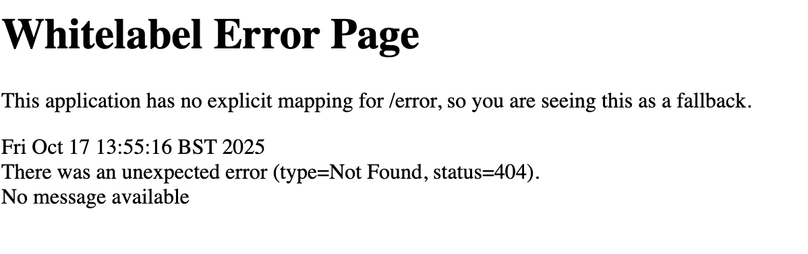
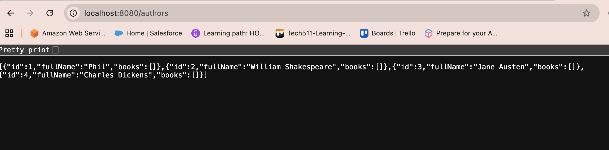
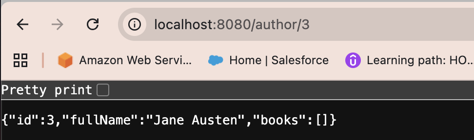
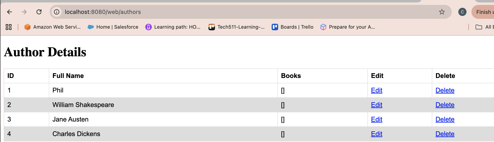
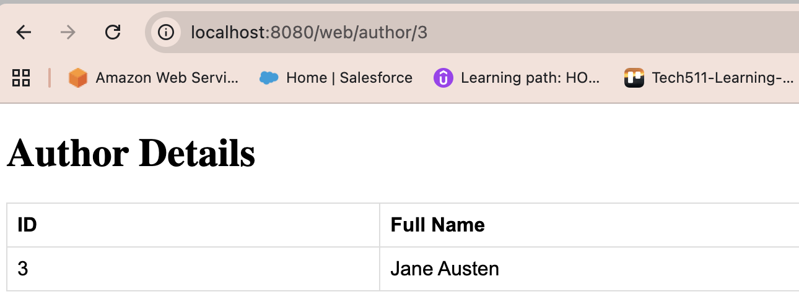

- [Library Java 17 MySQL Application — Local Deployment Guide](#library-java-17-mysql-application--local-deployment-guide)
  - [Overview](#overview)
    - [Java](#java)
    - [Spring Boot](#spring-boot)
    - [MySQL](#mysql)
  - [Installing Dependencies](#installing-dependencies)
    - [Install Java (Temurin 17)](#install-java-temurin-17)
    - [Install Maven](#install-maven)
    - [Install and Start MySQL](#install-and-start-mysql)
  - [Database Setup](#database-setup)
  - [Application Configuration](#application-configuration)
  - [Ports and Networking](#ports-and-networking)
    - [Default Port (5000)](#default-port-5000)
    - [macOS Note — Port 8080](#macos-note--port-8080)
  - [Verifying the Application](#verifying-the-application)
  - [Stopping the Application](#stopping-the-application)
  - [Testing the Application](#testing-the-application)
  - [Web Interface](#web-interface)
    - [View All Authors](#view-all-authors)
    - [View Author by ID](#view-author-by-id)


# Library Java 17 MySQL Application — Local Deployment Guide

This documentation explains the setup, configuration, and purpose of each part of a Java 17 MySQL project using Spring Boot. It is written to help beginners understand what each component does and why each step is necessary.

---

## Overview

### Java
Java is a popular programming language used to build all kinds of software — from simple apps to large systems. It is known for being fast, secure, and reliable.

In this project, Java is what the code is written in. It provides the base for the Spring Boot application, which handles the logic and connects to the MySQL database.

When Java code is written, it is compiled (converted) into a form called bytecode. This runs on the Java Virtual Machine (JVM) — a program that allows Java to run on any computer, whether macOS, Windows, or Linux.

The version used here is Java 17 (Temurin JDK). It is a modern, stable version that will be supported for many years, making it a reliable choice for most projects.

---

### Spring Boot
Spring Boot is a Java framework that simplifies the process of building and running web applications. It automatically handles much of the underlying configuration, allowing developers to focus on application logic rather than infrastructure setup.

In this type of project, Spring Boot runs the backend of the application — it serves web pages and API responses through an embedded Tomcat web server. 

Running the command `mvn spring-boot:run` or `mvn spring-boot:start` starts the application and makes it accessible locally through a web browser.

Spring Boot handles:
- Loading configuration files (such as `application.properties`)
- Managing dependencies and database connections
- Automatically starting and stopping the web server

---

### MySQL
MySQL is a relational database management system used to store and organise structured data.

It stores data in tables and allows operations such as querying, inserting, updating, and deleting records using SQL (Structured Query Language).

In this setup, MySQL acts as the data storage layer. The Spring Boot application connects to MySQL to access and modify data stored within the database.

---

## Installing Dependencies

### Install Java (Temurin 17)
Temurin 17 is an open-source distribution of Java, available through Homebrew on macOS.

```bash
brew update  
brew install temurin17
```  

Verify the installation:

```bash
java --version  
```

Expected output:

```bash
openjdk 17.0.16 2025-07-15  
OpenJDK Runtime Environment Temurin-17.0.16+8 (build 17.0.16+8)  
OpenJDK 64-Bit Server VM Temurin-17.0.16+8 (build 17.0.16+8, mixed mode)
```

---

### Install Maven
Maven is a build automation and dependency management tool for Java projects.

```bash
brew install maven  
```

Check installation:

```bash
mvn -v  
```

Expected output:

```bash
Apache Maven 3.9.9 (df98fd9a1e7e..., built on 2025-04-30T12:00:00Z)....
```

---

### Install and Start MySQL
MySQL can also be installed and managed via Homebrew.

```bash
brew install mysql  
brew services start mysql  
```

Verify installation:

```bash
mysql --version 
``` 

Expected output:  

```bash
mysql  Ver 9.4.0 for macos14.7 on x86_64 (Homebrew)
```

---

## Database Setup

Open the MySQL shell:

```bash
mysql -u root
``` 

Inside MySQL, create and use a database for the application. The library database is simply the example database created for this project.

It represents a small library system — a place to store and manage data such as authors, books, and relationships between them:

```bash
CREATE DATABASE `library`;  
USE `library`;  
```

Seed the database with test data from the SQL script provided in the project:

```bash
SOURCE /path/to/library.sql;  
```

Confirm that the data loaded correctly:

```bash
SHOW TABLES;  
SELECT * FROM authors;
```

---

## Application Configuration

The Spring Boot configuration file is located at `src/main/resources/application.properties`.

This file defines the database connection details and server settings.

```bash
spring.jpa.show-sql=true  
spring.datasource.url=${DB_HOST}  
spring.datasource.username=${DB_USER}  
spring.datasource.password=${DB_PASS}  
server.port=5000  
spring.jpa.hibernate.ddl-auto=update  
```

The placeholders (${...}) reference environment variables. These must be defined before running the application so that Spring Boot can connect to the database.

```bash
export DB_HOST=jdbc:mysql://localhost:3306/library  
export DB_USER=root  
export DB_PASS=  
```

Run the application:

```bash
mvn spring-boot:start
```

---

## Ports and Networking

### Default Port (5000)
The application is configured to use **port 5000** by default. This is the port through which the web server listens for requests.

### macOS Note — Port 8080
On macOS, port 5000 is often reserved by the **Control Centre** process (`ControlCe`), which can prevent the application from starting.

If this occurs, change the `server.port` value in `application.properties` to **8080** instead:

```bash
server.port=8080  
```

Port 8080 is a standard, unprivileged alternative to port 80 and rarely conflicts with other system processes.

---

## Verifying the Application

To confirm that the application is running:

```bash
lsof -i :8080  
```

(or replace 8080 with 5000 if that port is being used)  

If a Java process is shown as listening on the specified port, the application is active.

Alternatively, open a browser and navigate to:

```bash
http://localhost:8080  
or  
http://localhost:5000  
```

---

## Stopping the Application

If the application was started in the background:

```bash
mvn spring-boot:stop  
```

---

## Testing the Application

When deployed to a remote server, such as AWS or Azure, endpoints can be tested using the instance’s public IP address.

Examples:

Base URL:  
`http://localhost:8080`  

If the base URL displays a “Whitelabel Error Page,” the application is running correctly but no default route is defined.



Authors API:  
`http://localhost:8080/authors` 



Specific Author:  
`http://localhost:8080/author/3`  



---

## Web Interface

### View All Authors

Access:  
`http://localhost:8080/web/authors` 
(or replace with port 5000 if using the default)



### View Author by ID

Access:  
`http://localhost:8080/web/author/<id>`


