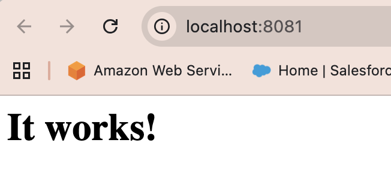

# Docker

- [Docker](#docker)
  - [Monolithic vs. Microservices Architecture](#monolithic-vs-microservices-architecture)
    - [Monolithic Architectures](#monolithic-architectures)
    - [Microservices Architecture](#microservices-architecture)
  - [Containers](#containers)
  - [Docker](#docker-1)
    - [Why Use Docker](#why-use-docker)
    - [Docker Alternatives](#docker-alternatives)
    - [Docker Success Story: Spotify](#docker-success-story-spotify)
      - [Challenge](#challenge)
      - [Solution](#solution)
      - [Results / Benefits](#results--benefits)
  - [Docker Architecture](#docker-architecture)
    - [Example: Running a Container](#example-running-a-container)
  - [How Docker Works](#how-docker-works)
  - [Downloading Docker Desktop](#downloading-docker-desktop)
    - [Installation and Account Setup](#installation-and-account-setup)
  - [Container Basics](#container-basics)
    - [Viewing and Managing Containers in Docker Desktop](#viewing-and-managing-containers-in-docker-desktop)
    - [Understanding Container Images](#understanding-container-images)
    - [First Pull and Run: hello-world](#first-pull-and-run-hello-world)
    - [Creating a Simple Custom Image](#creating-a-simple-custom-image)
      - [Without a Dockerfile](#without-a-dockerfile)
      - [With a Dockerfile](#with-a-dockerfile)
    - [Removing a Container](#removing-a-container)
    - [Forcibly Removing a Running Container](#forcibly-removing-a-running-container)
  - [Customising Nginx Containers](#customising-nginx-containers)
    - [1. Manual Edits Inside a Running Container](#1-manual-edits-inside-a-running-container)
    - [2. Using Docker Desktop](#2-using-docker-desktop)
    - [3. Using a Dockerfile (Reusable \& Recommended)](#3-using-a-dockerfile-reusable--recommended)
  - [Further Examples of Container on Different Ports](#further-examples-of-container-on-different-ports)
  - [Hosting Custom Images on Docker Hub](#hosting-custom-images-on-docker-hub)
    - [Why Use Docker Hub](#why-use-docker-hub)
    - [Preparing a Custom Image](#preparing-a-custom-image)
    - [Creating a Repository on Docker Hub](#creating-a-repository-on-docker-hub)
    - [Logging In via Terminal](#logging-in-via-terminal)
    - [Creating an Image from a Running Container](#creating-an-image-from-a-running-container)
    - [Tagging the Local Image](#tagging-the-local-image)
    - [Pushing the Image to Docker Hub](#pushing-the-image-to-docker-hub)
    - [Verifying the Upload](#verifying-the-upload)
  - [Docker Compose](#docker-compose)
    - [Why Use Docker Compose?](#why-use-docker-compose)
    - [Common Use Cases](#common-use-cases)
  - [How to Use Docker Compose](#how-to-use-docker-compose)
    - [How to Install](#how-to-install)
    - [The Compose File](#the-compose-file)
    - [Starting and Stopping an Application](#starting-and-stopping-an-application)
    - [Managing Individual Services](#managing-individual-services)
    - [Running One-Time Commands](#running-one-time-commands)
    - [Running One-Time Commands](#running-one-time-commands-1)
    - [Viewing Container Information](#viewing-container-information)

## Monolithic vs. Microservices Architecture

### Monolithic Architectures

In a **monolithic architecture**, all parts of an application — such as the user interface, business logic, and data access layer — are built and deployed as one single, tightly connected unit.  
If one part of the system experiences an issue or high demand, the entire application must be scaled or redeployed as a whole.  

This can make development slower, updates more risky, and scaling inefficient.

**Key Characteristics:**
- A single codebase containing all application logic.  
- All features are deployed together as one package.  
- Components are tightly coupled, so changes in one area can affect others.  
- A single point of failure can bring down the entire system.

**Drawbacks:**
- Difficult to scale specific parts of the application independently.  
- Slower release cycles as one small change requires redeploying everything.  
- Harder for large teams to work simultaneously without conflicts.  
- Failures in one part can impact the whole system.

---

### Microservices Architecture

A **microservices architecture** breaks an application into smaller, independent services. Each service focuses on a single business function (for example: payments, authentication, or user management).  

Each microservice can be developed, tested, deployed, and scaled independently. The services communicate using lightweight APIs, such as REST or message queues.

Microservices are commonly deployed in **containers**, as containers provide the perfect environment for running independent services. Each service can live inside its own isolated container, making the overall system more reliable and flexible.

**Key Characteristics:**
- Each service performs one specific function.  
- Services are independently deployable and maintainable.  
- Communication happens through well-defined interfaces (usually HTTP APIs).  
- Teams can build and deploy services separately using different technologies.

**Benefits:**
- **Agility:** Faster development cycles and independent releases.  
- **Scalability:** Scale individual services rather than the whole system.  
- **Resilience:** If one service fails, others continue running.  
- **Flexibility:** Different technologies can be used for different services.  
- **Efficiency:** Reusable, modular components reduce duplicated work.  
- **Ease of Deployment:** Supports continuous integration and delivery (CI/CD).  

Microservices define *how* an application is structured — as small, self-contained units. Containers define *how* those units are run — in lightweight, isolated environments that behave consistently across different systems.

---

## Containers

A **container** is a lightweight, standalone package that includes everything needed to run an application: the code, dependencies, libraries, and configuration files.  

Containers run on top of an existing operating system but remain fully isolated from one another using features of the Linux kernel (such as **namespaces** and **control groups**).  

This isolation allows multiple containers to run on the same machine without interfering with each other. They start quickly, use fewer resources than virtual machines, and can be moved easily between environments.

**How Containers Support Microservices:**  
In a microservices system, each service can be placed in its own container. This ensures consistent behaviour across environments and allows each service to be deployed, tested, and scaled independently. Containers help maintain stability as systems grow in size and complexity.

**Key Features of Containers**

1. **Portability**  
   Containers ensure that applications run the same way everywhere — whether on a developer’s laptop, a test server, or in the cloud.  
   > Example: A web application built in Linux can run seamlessly on Windows or macOS using Docker containers.

2. **Isolation**  
   Each container runs in its own isolated environment, keeping its processes and data separate from other containers and the host system.

3. **Efficiency**  
   Containers share the host operating system’s kernel, making them faster and more lightweight than traditional virtual machines.  
   This allows for higher density — running more containers on the same hardware.

4. **Consistency**  
   Containers eliminate the “works on my machine” problem by providing a predictable and repeatable runtime environment for applications.

5. **Scalability**  
   Containers can be started, stopped, replicated, or removed quickly. This allows applications to handle varying levels of demand efficiently.

Containers define *how* modern applications are executed — providing the flexibility and reliability needed to build scalable, distributed systems.

---

## Docker

**Docker** is a platform that simplifies the process of building, running, and managing containers.  
It provides a consistent way to package applications and their dependencies into **images**, store them in **registries**, and run them as **containers** on any system that has Docker installed.

While containerisation existed before Docker, it was complex to implement manually. Docker made containers accessible to everyone by introducing simple commands, automation, and standardised formats.

**Docker Workflow Overview**
1. **Build:** Create an image from a `Dockerfile`, which defines everything needed to run the application.  
2. **Ship:** Push the image to a registry (e.g. Docker Hub) for distribution.  
3. **Run:** Pull the image and start containers on any machine with Docker installed.  

This approach ensures that applications behave identically across development, testing, and production environments.

---

### Why Use Docker

1. **Fast, Consistent Delivery**  
   Docker enables developers to work in identical environments, reducing bugs caused by system differences.  
   It fits seamlessly into CI/CD pipelines for automated testing and deployment.

2. **Scalability and Flexibility**  
   Docker containers can be deployed on laptops, servers, or cloud environments with minimal setup.  
   Applications can scale up or down instantly by running more or fewer containers.

3. **Resource Efficiency**  
   Containers are lightweight, using fewer resources than virtual machines.  
   More containers can run on the same hardware, reducing costs and improving utilisation.

4. **Simplified Collaboration**  
   Teams can share images through Docker Hub or private registries, ensuring consistent builds and predictable deployments.

Docker provides the foundation that makes containerisation standardised, reliable, and easy to implement across all environments.

---

### Docker Alternatives

While Docker remains the industry standard for containerisation, several alternatives offer similar functionality with different levels of integration and support.

- **Podman** – Open-source, daemonless, and rootless by default, offering strong security but lacking Docker’s unified management and desktop tools.  
- **containerd** – A lightweight container runtime used by both Docker and Kubernetes; efficient but minimal, requiring extra tools for building and registry management.  
- **LXC/LXD** – System-level containers that emulate full operating systems; suitable for infrastructure use cases but less streamlined for developers.  
- **DIY OSS Stack** – Combining open-source tools can replicate Docker’s functionality but lacks central administration, integrated registries, and enterprise-grade security or support.

**Key Difference:**  

Docker Business delivers an integrated, enterprise-ready suite (Docker Desktop, Hub, Scout, Build Cloud, Testcontainers) that provides advanced security, policy management, and support out of the box — capabilities that alternatives require additional tools and maintenance to match.

---

### Docker Success Story: Spotify

**Company:** Spotify AB — a global music streaming platform serving hundreds of millions of users monthly.  
**Technology Focus:** Containers (via Docker) and orchestration (via Kubernetes) within a microservices architecture.

#### Challenge  
Spotify had already adopted microservices and containerised many services using Docker as early as 2014, running them across a fleet of virtual machines.  
However, managing and orchestrating thousands of containers became complex and costly when using its in-house tool, Helios.  

#### Solution  
- Migrated from Helios to Kubernetes while continuing to use Docker for containerisation.  
- Implemented Docker-based microservices that could be scaled, updated, and deployed more efficiently.  
- Leveraged Kubernetes to automate container scheduling, load balancing, and scaling across global infrastructure.  

#### Results / Benefits  
- Deployment times reduced from hours to minutes, significantly improving release speed.  
- Resource utilisation improved through more efficient scheduling and scaling.  
- Developer productivity increased as teams could focus on delivering new features rather than managing infrastructure.  
- The platform now runs over 1,600 production services, each independently containerised, maintaining reliability at massive scale.  

---

## Docker Architecture

Docker operates on a **client–server model**, consisting of three main components that work together:

1. **Docker Client (`docker`)**  
   - The command-line interface that developers use to interact with Docker.  
   - Sends commands like `docker run` or `docker build` to the Docker daemon.  
   - Communicates via the Docker API and can connect to local or remote servers.

2. **Docker Daemon (`dockerd`)**  
   - The background service that manages containers, images, networks, and volumes.  
   - Handles tasks such as building images, starting containers, and maintaining system state.  
   - Can communicate with other daemons to manage distributed services across multiple hosts.

3. **Docker Registries**  
   - Repositories where images are stored and shared.  
   - **Docker Hub** is the default public registry, but private registries are also supported.  
   - Commands like `docker pull` download images, and `docker push` uploads them.

4. **Docker Objects**  
   - **Images:** Templates that define how containers are built and configured.  
   - **Containers:** Running instances of images.  
   - **Networks:** Define communication between containers.  
   - **Volumes:** Provide persistent data storage beyond a container’s lifecycle.

Docker’s client–server design allows developers to run containers locally or remotely with the same commands, simplifying both development and deployment.

---

### Example: Running a Container

1. Docker checks if the `ubuntu` image exists locally. If not, it downloads it from **Docker Hub**, a central image repository.  
2. A new container is created from that image — a live instance of the predefined template.  
3. Docker allocates a writable filesystem layer on top of the image, allowing changes during runtime.  
4. A virtual network interface connects the container to the host system.  
5. The command `/bin/bash` starts an interactive shell session inside the container.  
6. When the `exit` command is used, the container stops but remains stored on the system until manually removed.

This process demonstrates how Docker standardises container creation and execution across all environments.

---

## How Docker Works

Docker is written in **Go** and uses several core **Linux kernel features** to create and manage containers efficiently:

- **Namespaces:**  
  Create isolated environments, ensuring that processes, networks, and mounts within one container cannot interact with others.  

- **Control Groups (cgroups):**  
  Manage and limit system resources such as CPU, memory, and disk I/O for each container.  
  This prevents a single container from overusing resources and affecting others.

- **Union File Systems (UnionFS):**  
  Combine multiple read-only and writable filesystem layers into a single unified view.  
  Each layer represents part of the container’s state, making image creation and updates lightweight and efficient.

- **Container Format:**  
  Defines a consistent package that bundles these technologies, ensuring containers behave predictably across systems.

These technologies together make containers lightweight, secure, and fast. Multiple containers can run on the same host machine, each isolated but sharing system resources efficiently.

---

## Downloading Docker Desktop

**Docker Desktop** is an easy-to-install application that provides a complete environment for building, running, and managing containers on macOS, Windows, and Linux. 
 
It includes all the core Docker components — the **Docker Engine**, **Docker CLI**, **Docker Compose**, and a visual dashboard for managing images, containers, networks, and volumes.

Docker Desktop simplifies local container development by allowing images to be pulled, built, and run through either the command line or the graphical interface. It is the recommended tool for learning and developing with Docker.

### Installation and Account Setup

Before downloading, a **Docker account** is required.  
A free account can be created at [https://hub.docker.com/signup](https://hub.docker.com/signup).  

This account allows access to **Docker Hub**, where official images are hosted and personal images can be stored or shared.

Once an account is created, install Docker Desktop by following the official guides:

- [Install Docker Desktop on Windows](https://docs.docker.com/desktop/setup/install/windows-install/)  
- [Install Docker Desktop on macOS](https://docs.docker.com/desktop/setup/install/mac-install/)

After installation, sign in to Docker Desktop using the Docker Hub account credentials.  

When the **Docker whale icon** appears in the system tray or menu bar, Docker Desktop is running and ready to manage images and containers.

## Container Basics

### Viewing and Managing Containers in Docker Desktop

In the container tab:


- **Starting a Container:**  
  Once a container has been created or stopped, it can be restarted directly in Docker Desktop.  
  To do this, select the container under the **Containers** tab and click the **Play** (▶) button.  
  This action starts the container again using its previous configuration, including assigned ports, environment variables, and mounted volumes.  
  When running, the container becomes active and ready to serve applications or content immediately.

- **Viewing a Running Container:**  
  Select the **port number** shown in Docker Desktop to open the running container in a browser.  
  This allows verification that the container is active and serving the expected content.

- **Inspecting Container Files:**  
  Select the **container name** in Docker Desktop to view its internal file system, configuration, and logs.

- **Stopping a Container:**  
  Use the **Stop** button in Docker Desktop to safely stop a running container without deleting it.  
  Containers can later be restarted or removed as needed.

### Understanding Container Images

A **container image** is a standardised, pre-packaged environment that includes all the files, binaries, libraries, and configurations required to run a container.  

It acts as a **blueprint** for creating one or more containers — each container being a running instance of that image.

Examples:
- A **PostgreSQL image** includes the database binaries, configuration files, and dependencies.  
- A **Python application image** includes the Python runtime, application code, and required packages.

**Key Principles of Images:**

1. **Immutability:**  
   Once created, an image cannot be modified. Any change requires creating a new image or adding a new layer on top of the existing one.

2. **Layered Structure:**  
   Images consist of multiple layers, each representing changes to the filesystem (for example, adding or removing files).  

   These layers stack together to form the final image, improving efficiency and allowing shared base layers between images.


* This example  is just one possible stack — a Python-based application image.*

This layered structure allows extension of existing images. For instance, a custom application can start from a base image such as `python` or `nginx` and add only the necessary dependencies and application files.  

This approach keeps builds lightweight, modular, and focused on the application rather than the underlying system.

---

### First Pull and Run: hello-world

The hello-world image provides a simple way to verify that Docker has been installed correctly and is functioning as expected.  

It runs a small container that prints a confirmation message from inside the Docker environment, demonstrating the basic process of pulling, creating, and running containers.

When executed, Docker performs several steps automatically:

1. Checks whether the hello-world image already exists locally.  
2. If the image is missing, it downloads it from Docker Hub — the central repository for container images.  
3. Creates a new container from that image.  
4. Runs the container, which prints a short message confirming successful setup, then exits.

To get help from the docker command:

```bash
docker --help
```

To view existing local images: 

```bash
docker images  
```
To download and run the hello-world image:  

```bash
docker run hello-world  
```

Example output:

```bash
$ docker run hello-world

Hello from Docker!
This message shows that your installation appears to be working correctly.
```

Running the hello-world image for the first time automatically pulls it from Docker Hub if it does not already exist locally. The command creates a container, displays a confirmation message, and then exits once complete.  

When the image is executed a second time, Docker does not perform another download because the image is already cached locally. The container starts instantly and produces the same output.  

**Behaviour comparison:**  
- *Image not present:* Docker retrieves the required layers from the registry before starting the container.  
- *Image present locally:* Docker skips the download process and launches the container immediately using the cached image.

---

### Creating a Simple Custom Image

A new image can be created in two main ways — **with** or **without** a Dockerfile.

---

#### Without a Dockerfile

An image can be customised directly from an existing one without writing a Dockerfile.  

For example, the official **Nginx** image can serve local files by linking a local directory to the container:

```bash
docker run --name some-nginx -d -p 8080:80 -v /path/to/local-folder:/usr/share/nginx/html nginx
```

This command:
- Uses the official **nginx** image.  
- Runs it in the background (`-d`).  
- Maps port **8080** on the host machine to port **80** in the container.  
- Uses **-v** to share a local folder with the container, allowing Nginx to serve files from that directory.

To verify that the nginx container is running: 

```bash
docker ps  
```

This command lists all active containers along with their container ID, name, status, exposed ports, and associated image.  

If nginx is running correctly, its status will show as “Up” and the port mapping (for example, 0.0.0.0:80->80/tcp) will confirm that it is exposed on port 80 of the local machine.  

This approach is useful for quick testing or demos. However, any changes made are temporary — removing the container deletes its configuration.  

For consistent and repeatable setups, a Dockerfile should be used.

---

#### With a Dockerfile


A **Dockerfile** defines how an image should be built. It specifies a base image, adds files, and lists commands to run during the build process.  

This method is ideal for reusable and version-controlled environments.

**Within the Dockerfile:**

```bash
FROM nginx  
COPY static-html-directory /usr/share/nginx/html
```

*Note: the Nginx base image used in this Dockerfile is pulled from Docker Hub.* 

- **FROM nginx**  
  Uses the official Nginx image as the starting point, which already includes a fully configured web server and a default “Welcome to nginx!” homepage.

- **COPY static-html-directory /usr/share/nginx/html**  
  Copies all local web files from a folder named `static-html-directory` into Nginx’s default web directory inside the container.  
  If this folder is empty or doesn’t exist, Docker still builds the image successfully — Nginx simply continues to serve its built-in default homepage.

This Dockerfile still works even without custom files. If `static-html-directory` contains a custom `index.html` or other assets, they’ll replace Nginx’s default content when built.

---

**Build and Run the Container**

```bash
docker build -t some-content-nginx .  
docker run --name some-nginx -d -p 8080:80 some-content-nginx
```

- **-t some-content-nginx**  
  Tags (names) the new image for easier reference.  
- **--name some-nginx**  
  Assigns a readable name to the container instance.  
- **-d**  
  Runs the container in detached mode (in the background).  
- **-p 8080:80**  
  Maps port 8080 on the host to port 80 inside the container so the site can be viewed at localhost:8080.

If a container is run directly from the base Nginx image, it still appears in Docker Desktop, but no new image is created.  

Using a Dockerfile ensures a **reusable, consistent build** that can include custom static content when needed.

---

### Removing a Container

1. **List containers** to find the name or ID:  
   docker ps -a  

2. **Stop the container** if it’s still running:  
   docker stop <container-name>  

3. **Remove the container:**  
   docker container rm <container-name>  

Alternatively, use Docker Desktop:  
- Open the **Containers** tab.  
- Stop the container if needed.  
- Click the **Delete (🗑️)** icon to remove it.

---

### Forcibly Removing a Running Container

Attempting to remove a container while it is still running will return an error message similar to:

```bash
"Error response from daemon: You cannot remove a running container <container_id>. Stop the container before attempting removal or use the -f flag."
```

This confirms that Docker prevents the removal of active containers by default as a safeguard against accidental deletion.

To forcibly remove a running container without stopping it first: 

```bash
docker rm -f <container-name>
```

Using the -f (force) option stops the container and removes it in a single command.

To confirm that the container has been removed:  

```bash
docker ps -a  
```

The container should no longer appear in the list, indicating successful removal.

---

## Customising Nginx Containers

Nginx containers can be customised in several ways depending on what’s needed.  


The three most common beginner-friendly methods are:

---

### 1. Manual Edits Inside a Running Container

Used for quick testing or learning how containers work.

**From local:**

- Copy the image into the container:

```bash  
  docker cp /path/to/local/image.jpg <container-name>:/usr/share/nginx/html  
```

**Access the container shell:**

```bash
docker exec -it <container-name> /bin/bash
```

**Inside the container:**
- Navigate to the web directory:  

```bash
cd /usr/share/nginx/html` 
```

- View the html file:

```bash
  `cat index.html`
```

When running Docker on Windows through Git Bash, the terminal can sometimes struggle to run interactive programs properly because Git Bash does not use a full terminal environment (known as a TTY).  

A **TTY **is simply a text-based interface that lets commands receive input and show output in real time — for example, when opening an interactive shell like /bin/bash or editing a file with nano inside a container.  

Git Bash runs on top of a compatibility layer called MSYS2, which does not fully support the same console features that PowerShell or WSL provide.  

Because of this, some interactive Docker commands may not work as expected unless a tool such as winpty is used to fix the issue.
 
As a result, commands such as:  

```bash
docker exec -it <container-name> bash  
```

may produce the error message:  

```bash
"the input device is not a TTY"
```

**winpty** is a lightweight Windows utility that emulates a proper TTY environment so that interactive commands function correctly.  

Creating an alias ensures Docker commands automatically use winpty when launched from Git Bash, removing the need to type it manually each time:  

```bash
alias docker="winpty docker"
```

PowerShell and WSL do not require this workaround because both already provide native TTY support.

The command to update and upgrade packages within a running container is:  

```bash
apt-get update && apt-get upgrade -y  
```

If the sudo command is not recognised, it can be installed with:  

```bash
apt-get install sudo  
```

Some lightweight base images, such as nginx, do not include nano or sudo by default. To edit files within the container, the nano text editor may need to be installed.

```bash
apt-get install nano  
``` 

In certain cases, file edits can still be performed using pre-installed tools such as vi, vim, or by using stream editors like sed without installing nano.  

The nano installation step simply ensures a text editor is available if preferred.


- Edit the HTML file inside the container:
  ```bash  
  sed -i '/<p><em>Thank you for using nginx.<\/em><\/p>/a ' /usr/share/nginx/html/index.html  
  ```


These changes disappear when the container is removed — useful for experimentation, not production.

---
### 2. Using Docker Desktop

A practical visual method for inspecting or making quick edits.

- Open the container in **Docker Desktop**.  
- Select the container name and open the **Files** tab to browse to `/usr/share/nginx/html`.  


The **Files** tab allows editing and deleting existing files, but does not support drag-and-drop uploads so the image will need to be copied using the command above. 

- Edit `index.html` within the editor & save.


 
- Restart the container to apply changes.  

This method is suitable for visual exploration and verifying file behaviour inside a running container.


---

### 3. Using a Dockerfile (Reusable & Recommended)

For consistent, reusable customisation.

**Dockerfile example:**

```bash
FROM nginx  
COPY static-html-directory /usr/share/nginx/html  
COPY docker_poppy.jpg /usr/share/nginx/html/
```

*Note The image file (docker_poppy.jpg) must be located in the same directory as the Dockerfile, since Docker copies files relative to the build context (the folder where the docker build command is run).*

**Explanation:**
- **FROM nginx** – starts from the official Nginx base image.  
- **COPY static-html-directory /usr/share/nginx/html** – replaces the default homepage with local files.  
- **COPY docker_poppy.jpg /usr/share/nginx/html/** – adds the image file.

**Project structure:**
project-folder/  
│  
├── Dockerfile  
├── docker_poppy.jpg  
└── static-html-directory/  
  └── index.html  

**Build and run:**

```bash
docker build -t some-content-nginx .  
docker run --name some-nginx -d -p 8080:80 some-content-nginx  
```

Using a Dockerfile guarantees the custom homepage and image are always included when the image is rebuilt or shared.


## Further Examples of Container on Different Ports

**Apache (httpd):**

`docker run --name some-apache -d -p 8081:80 httpd`



**Python Simple HTTP Server**

`docker run --name some-python -d -p 8082:8000 python:3.12-slim python -m http.server 8000`


**Nginx Dreamteam Container**

Attempting to run another container on the same port as the existing nginx container results in an error because port 80 is already in use by the first container. The Docker daemon prevents multiple containers from binding to the same host port.

Example error message:

```bash
Error response from daemon: driver failed programming external connectivity on endpoint nginx-257 (container_id): Bind for 0.0.0.0:80 failed: port is already allocated
```

The conflicting container must be removed or stopped before reusing the same port. To avoid this conflict, a different host port can be mapped to the container’s internal port 80.

```bash
docker run --name nginx-dreamteam -d -p 90:80 daraymonsta/nginx-257:dreamteam
```

This runs the nginx container using port 90 on the host machine while still connecting to port 80 inside the container. The webpage is then accessible at http://localhost:90 in a web browser, confirming the container is running successfully on a different port.

## Hosting Custom Images on Docker Hub

Once a custom container image has been created locally, it can be shared publicly or privately through **Docker Hub**. Docker Hub acts as a central registry for storing and distributing container images, similar to how GitHub hosts code repositories. It allows developers and teams to publish, version, and share their containerised applications for others to download and run easily.  

Using Docker Hub provides a consistent way to distribute containerised environments across systems, ensuring that applications run identically in development, testing, and production environments.

---

### Why Use Docker Hub

- **Collaboration:** Share container images with teammates or the wider community.
- **Version Control:** Tag and manage different versions of the same image.
- **Reproducibility:** Ensure consistent environments across multiple machines.
- **Automation:** Integrate into CI/CD pipelines for seamless deployment.

Docker Hub can host both public and private repositories. Public repositories are accessible to everyone, while private ones restrict access to authorised users.

---

### Preparing a Custom Image

Before pushing an image to Docker Hub, ensure that a working container image has been built locally. This image should be based on a Dockerfile that automates the build process.

A typical example involves creating a simple static webpage hosted by Nginx:

**Project structure:**

project-folder/  
├── Dockerfile  
└── static-html-directory/  
  └── index.html  

**index.html:**

<html>  
  <head><title>Hello World</title></head>  
  <body>  
    <h1>Hello from my Docker container!</h1>  
  </body>  
</html>  

When this directory structure is used with the Dockerfile:

```bash
FROM nginx  
COPY static-html-directory /usr/share/nginx/html  
```

and built using the standard `docker build` command, Nginx will serve the simple "Hello World" page instead of its default welcome screen.

After defining the Dockerfile, the image can be built locally. See previous steps for build and run commands.


---

### Creating a Repository on Docker Hub

1. Visit **https://hub.docker.com/** and log in to your Docker account.  
2. Navigate to **Repositories → New Repository**.  
3. Enter a repository name (for example, `host-custom-static-webpage`).  
4. Set visibility to **Public** or **Private**.
5. Click **Create**.

This creates a remote repository ready to receive pushed images from the local machine.

---

### Logging In via Terminal

To authenticate the local Docker client with Docker Hub, use the `docker login` command.  

Enter the same username and password used to sign in to the website.  

A confirmation message stating “Login Succeeded” confirms successful authentication.

---

### Creating an Image from a Running Container

If a container is already running locally and includes changes made manually (for example, an edited index.html file or added assets), a new image can be created directly from that container without rebuilding from a Dockerfile.  

This is achieved using the commit command: 

```bash
docker commit <container-name> <new-image-name>  
```

The command takes a snapshot of the container’s current state and saves it as a new image, preserving all modifications.  

Once created, the image appears in the local list of images and can be tagged and pushed to Docker Hub in the same way as any other image.

---

### Tagging the Local Image

Before pushing an image to Docker Hub, it must be tagged with the correct repository name and username.  

For example, if the Docker Hub username is `exampleuser` and the repository is named `host-custom-static-webpage`, the tag would be:

```bash
docker tag host-custom-static-webpage exampleuser/host-custom-static-webpage:latest
```

This assigns the image a full repository path that Docker Hub recognises.

---

### Pushing the Image to Docker Hub

Once tagged, the image can be uploaded using:

```bash
docker push exampleuser/host-custom-static-webpage:latest
```

Each image layer will upload sequentially. Once completed, the repository on Docker Hub will display the pushed tag (usually `latest`) and indicate the image is ready for public use.

---

### Verifying the Upload

To confirm the image was uploaded successfully:

1. Visit the repository page on Docker Hub.  
2. Check under the **Tags** tab for the uploaded image tag. 

![Successful Upload of Image to DockerHub] (../images/successful-upload-of-image-to-dockerhub.png)

3. Optionally, test by pulling the image back down to the local machine and running it:

```bash
docker pull exampleuser/host-custom-static-webpage:latest  
docker run -d -p 8080:80 exampleuser/host-custom-static-webpage:latest  
```
If the container runs and displays the expected application, the upload was successful.

## Docker Compose

**Docker Compose** is a tool for defining and running multi-container applications with a single YAML configuration file.


### Why Use Docker Compose?

Docker Compose simplifies the development, deployment, and management of containerised applications.

**Key Benefits:**

- **Simplified Control:**  
  Define and manage multiple containers in one YAML file, making orchestration and replication straightforward.  

- **Efficient Collaboration:**  
  Shareable Compose files ensure consistent environments and smoother collaboration between developers and operations teams.

- **Rapid Development:**  
  Compose caches configurations and reuses existing containers for unchanged services, allowing quick restarts and updates.  

- **Portability:**  
  Environment variables in Compose files allow customisation for different users or environments.

---

### Common Use Cases

**1. Development Environments**  
Compose lets developers spin up isolated environments with all dependencies (databases, queues, APIs, etc.) using a single command:

```bash
docker compose up
```

This replaces lengthy “getting started” guides with one configuration file and a few commands.

**2. Automated Testing Environments**  
In CI/CD pipelines, Compose can create and destroy isolated environments for end-to-end tests.  
Defining services in a Compose file ensures the same setup every time — ideal for repeatable, automated test runs.

## How to Use Docker Compose

### How to Install 

The easiest and recommended way to get Docker Compose is to install Docker Desktop.

Docker Desktop includes Docker Compose along with Docker Engine and Docker CLI which are Compose prerequisites.

### The Compose File

With Docker Compose, a YAML configuration file — known as the *Compose file* — is used to define an application's services.  

The Compose CLI uses this file to create, configure, and start all defined services together.

By default, the Compose file should be named **compose.yaml** (preferred) or **compose.yml**, and placed in the working directory.

### Starting and Stopping an Application

Once Docker Compose is installed and the configuration file is ready, the following commands are used to manage and control the application lifecycle.

```bash
docker compose up
```

Builds, (re)creates, starts, and attaches to all containers defined in the Compose file.  

If any required images are missing, Docker automatically pulls them from the registry or builds them locally.

When the command exits, all containers are stopped and logs are displayed directly in the terminal.  

This mode is useful for development or debugging since it provides real-time output from all running services.

To run containers in the background (detached mode), use the **--detach** flag.  

```bash
docker compose up --detach
```

This starts all services as background processes, freeing the terminal while keeping the containers active — ideal for long-running or production-like environments.

```bash
docker compose stop
```

The stop command stops all running containers without removing them.  
They can later be restarted using 

```bash
docker compose start
``` 

To completely remove containers, networks, and other resources created by *up*, use 

```bash
docker compose down
```

By default, this removes:  
- Containers for services defined in the Compose file.  
- Networks created for the application.  
- The default network, if one is used.
  
### Managing Individual Services

Docker Compose doesn’t have to manage everything in the file at once — individual services can be targeted.  

For example:  
- To start or stop only one service, specify its name after the command (e.g., docker compose up db or docker compose stop web).  
- Multiple services can be listed together to start or stop a specific subset.  

This allows more granular control during development or troubleshooting without affecting the rest of the stack.

---

### Running One-Time Commands

```bash
docker compose run web bash  
```

### Running One-Time Commands

docker compose run web bash  

The **run** command starts a temporary container for a service and runs a single command inside it.  

It’s mainly used for quick tasks such as testing, inspecting files, or performing setup steps.  

In this example, the command opens a bash shell inside the **web** service container.  
When the command finishes or the shell is closed, the container stops automatically.  

The **--detach** option runs the container in the background and prints its container ID instead of showing the output directly.


---

### Viewing Container Information

```bash
docker compose ps  
```
Lists all containers for the current Compose project, showing their status and exposed ports.  
This helps confirm which services are running and how they are mapped.  

```bash
docker compose logs  
```

Displays log output from running containers in real time.  

This shows information such as startup progress, connection attempts, and error messages.  

Logs can be viewed for all services or for a specific one by naming it, for example `docker compose logs web`

This helps monitor what each service is doing and makes it easier to identify issues as they happen.

```bash
docker compose images  
```

Lists all images used by the created containers in the project.  
  
Helps verify which images are being used and ensures they are up to date.