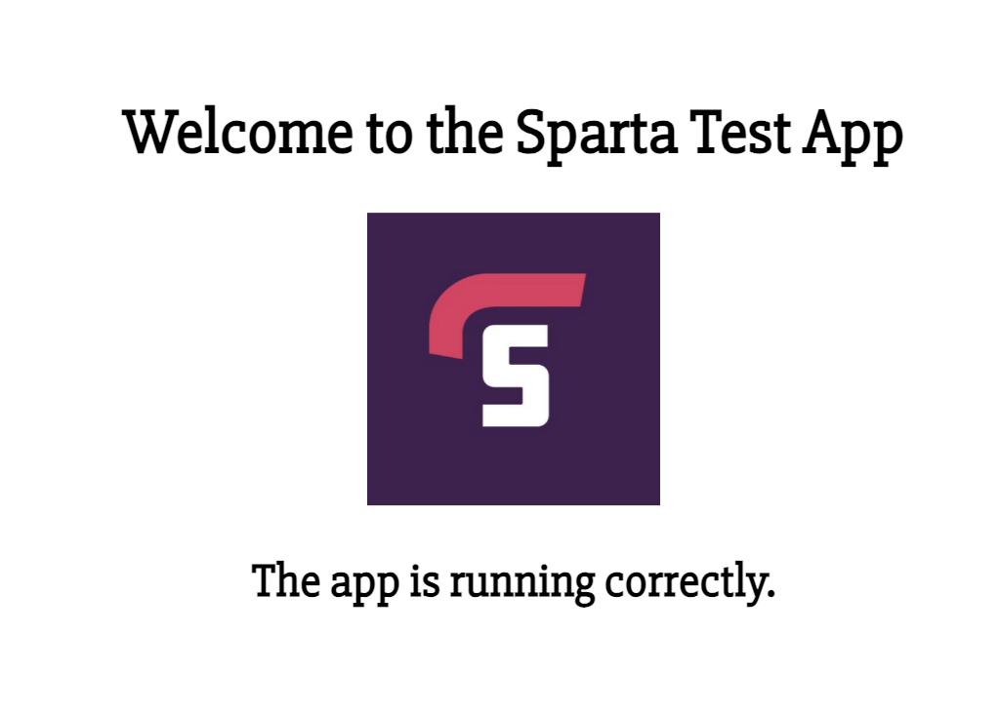
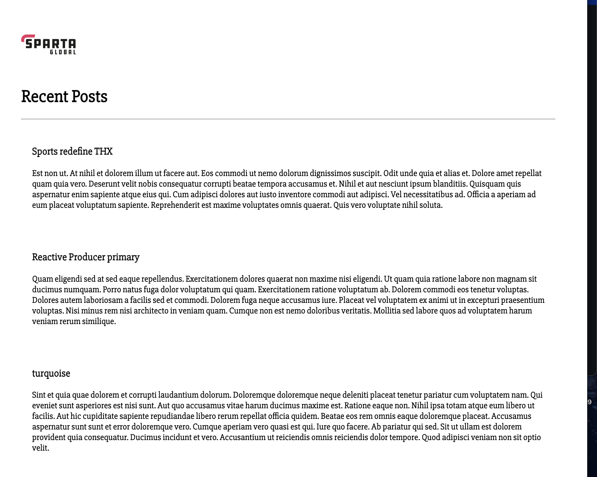

# Sparta Node Sample App – Containerisation and Deployment Documentation  

- [Sparta Node Sample App – Containerisation and Deployment Documentation](#sparta-node-sample-app--containerisation-and-deployment-documentation)
  - [Overview](#overview)
  - [Stage 1: Containerising the Application](#stage-1-containerising-the-application)
    - [Dockerfile](#dockerfile)
      - [Purpose](#purpose)
      - [Breakdown](#breakdown)
    - [Building and Running the Container](#building-and-running-the-container)
    - [Pushing the Image to Docker Hub](#pushing-the-image-to-docker-hub)
    - [Pulling and Running the Image from Docker Hub](#pulling-and-running-the-image-from-docker-hub)
  - [Stage 1.5 – Introducing Docker Compose for Multi-Container Setup](#stage-15--introducing-docker-compose-for-multi-container-setup)
    - [docker-compose.yml](#docker-composeyml)
      - [Purpose](#purpose-1)
      - [Breakdown](#breakdown-1)
  - [Stage 2 – Reverse Proxy (Nginx)](#stage-2--reverse-proxy-nginx)
    - [docker-compose.yml](#docker-composeyml-1)
      - [Purpose](#purpose-2)
      - [Breakdown](#breakdown-2)
    - [nginx.conf](#nginxconf)
      - [Purpose](#purpose-3)
      - [Breakdown](#breakdown-3)
  - [Stage 3 – Database (MongoDB)](#stage-3--database-mongodb)
    - [docker-compose.yml](#docker-composeyml-2)
      - [Purpose](#purpose-4)
      - [Breakdown](#breakdown-4)
    - [.env File](#env-file)
      - [Purpose](#purpose-5)
      - [Breakdown](#breakdown-5)
  - [Stage 4 – Database Seeding](#stage-4--database-seeding)
    - [Purpose](#purpose-6)
    - [Step-by-Step Seeding Instructions (Manual)](#step-by-step-seeding-instructions-manual)
    - [Automatic Seeding Methods](#automatic-seeding-methods)
    - [Updated Dockerfile](#updated-dockerfile)
    - [Updated docker-compose.yml](#updated-docker-composeyml)
    - [Why the Common Online Method Does Not Work](#why-the-common-online-method-does-not-work)
    - [Importance of Using `docker compose down -v`](#importance-of-using-docker-compose-down--v)
  - [Launching The App on an EC2 Instance](#launching-the-app-on-an-ec2-instance)

## Overview  

This documentation outlines the process of containerising the Sparta Node.js test application, running it in Docker, and extending it to use Docker Compose for managing multi-container environments. Each configuration file and command is explained clearly, describing what it does and why it is required.

---

## Stage 1: Containerising the Application 

The Sparta Node.js test app runs on Node v20 and serves three key pages:  

- Homepage (`localhost:3000`)  
- Blog posts page (`localhost:3000/posts`)  
- Fibonacci page (`localhost:3000/fibonacci/{index}`)  

The `/posts` route connects to a MongoDB database to display seeded data. Before seeding, only the page header is visible, indicating the connection is successful but no data exists yet.

---

### Dockerfile

#### Purpose  

The Dockerfile defines how to build a container image for the Node.js app. It specifies the base image, working directory, dependencies and startup commands.

#### Breakdown

```bash
FROM node:20  
LABEL description="Sparta test app container"  
WORKDIR /usr/src/app  
COPY app /usr/src/app  
COPY package*.json .  
RUN npm install  
EXPOSE 3000  
CMD ["node", "app.js"]  
```

**FROM node:20**  
- Specifies the base image to use for building the container.  
- Includes Node.js v20 and npm preinstalled.  
- Ensures the environment matches the version required by the Sparta app.

**LABEL description="Sparta test app container"**  
- Adds metadata to the container image.  
- Useful for documentation, identification, and management within registries.

**WORKDIR /usr/src/app**  
- Sets the default working directory for the container.  
- Any subsequent commands (COPY, RUN, CMD) execute from this location.  
- Ensures consistent directory structure across environments.

**COPY app /usr/src/app**  
- Copies the local `app` folder into the container.  
- The `app` directory contains the main application files.

**COPY package*.json .**  
- Copies both `package.json` and `package-lock.json` files.  
- Used by npm to install all project dependencies.  
- Placing this before `npm install` allows Docker to cache dependencies if the code changes later.

**RUN npm install**  
- Installs dependencies listed in `package.json`.  
- Runs inside the container image during build time.

**EXPOSE 3000**  
- Declares that the container listens on port 3000.  
- This does not publish the port outside the container; it is only a declaration for documentation and internal use.

**CMD ["node", "app.js"]**  
- Defines the default command executed when the container starts.  
- Runs the app directly with Node instead of using `npm start`.  
- Running Node directly ensures that system signals (like SIGTERM) are passed correctly to the process, allowing proper shutdowns.  
- Using `npm start` would prevent Docker and Kubernetes from sending termination signals to Node, potentially leaving connections open.

---

### Building and Running the Container

To create and run the containerised application:

1. Build the image  
   
```bash
docker build -t sparta-test-app .
```

2. Run the container and publish port 3000 

```bash 
docker run -d -p 3000:3000 --name sparta-app sparta-test-app:latest  
```

3. Confirm the container is running  

```bash
docker ps  
```

If the output shows a port mapping such as `0.0.0.0:3000->3000/tcp`, the application is accessible in a web browser at `http://localhost:3000`.



---

### Pushing the Image to Docker Hub

Once tested locally, the image can be uploaded to Docker Hub to allow reuse or deployment elsewhere.

1. Log in to Docker Hub  

```bash
   docker login  
```

2. Tag the local image with the Docker Hub username and repository name 

```bash 
   docker tag sparta-test-app <docker-username>/sparta-test-app:latest  
```

3. Push the image to Docker Hub  

```bash
   docker push <docker-username>/sparta-test-app:latest  
```

4. Verify the upload
   Check the repository page on Docker Hub under **Tags** to confirm the image has been published.

---

### Pulling and Running the Image from Docker Hub

To ensure the uploaded image works correctly and to test the full deployment process, pull a fresh copy from Docker Hub and run it again.

1. Stop the existing container running on port 3000

```bash  
   docker stop sparta-app  
```

2. Pull the latest version of the image 

```bash 
   docker pull <docker-username>/sparta-test-app:latest  
```

3. Run the image from Docker Hub  

```bash
   docker run -d -p 3000:3000 <docker-username>/sparta-test-app:latest  
```

This confirms that the remote image runs independently of the local build and that the deployment process is complete.

---

## Stage 1.5 – Introducing Docker Compose for Multi-Container Setup

Before adding Nginx and MongoDB, Docker Compose can already be used to manage the Node.js container.  
This section introduces the Compose configuration before expanding it to include other services in later stages.

---

### docker-compose.yml

#### Purpose  

The Node.js service defines how the Sparta app runs within Docker Compose.  

It builds from the local Dockerfile, sets up environment variables, and establishes dependency order with the MongoDB container.

#### Breakdown

```yml
  nodejs:
    image: chrleybolton/sparta-test-app:latest
    container_name: nodejs
    restart: unless-stopped
    env_file: ./.env
    depends_on:
      - mongodb
```

**nodejs:**  
- Defines a service named `nodejs`, which represents the Sparta Node.js application.  
- This service will build and run the app inside a container, using the Dockerfile from Stage 1.

**image: chrleybolton/sparta-test-app:latest**  
- Defines the image name and tag that will be created and optionally pushed to Docker Hub.  
- Ensures consistency between local builds and remote deployment environments.

**container_name: nodejs**  
- Assigns a fixed name to the running container.  
- Makes it easier to identify and connect to the container using Docker CLI commands (e.g., `docker exec -it nodejs bash`).

**restart: unless-stopped**  
- Automatically restarts the container if it stops unexpectedly (e.g., crash, reboot).  
- The container will only remain stopped if manually stopped by the user.
- Ensures reliable uptime and reduces the need for manual restarts after interruptions.

**env_file: ./.env**  
- Loads environment variables from the `.env` file in the project root directory.  
- These variables define connection credentials and hostnames for the MongoDB database.  
- This method centralises configuration and prevents hardcoding sensitive information inside the yml file.

**depends_on:**  
  - **mongodb**  
    - Ensures the MongoDB container starts before the Node.js container.  
    - This prevents the app from attempting to connect to the database before it is ready.  
    - Note: `depends_on` controls start order but does not verify readiness; health checks would be needed for that in production.

--- 

## Stage 2 – Reverse Proxy (Nginx)

### docker-compose.yml

#### Purpose

The Nginx container handles incoming HTTP requests and routes them to the Node.js application container.  

It listens on port 80 and uses a mounted configuration file to define its proxy rules.

Running Nginx as a reverse proxy allows users to access the application through standard web port 80 instead of the Node.js port (3000).

It also prepares the setup for production-style routing and future load balancing.

#### Breakdown

```bash
  nginx:  
    image: nginx:latest  
    container_name: nginx  
    ports:  
      - 80:80  
    volumes:  
      - ./nginx.conf:/etc/nginx/conf.d/default.conf:ro  
    depends_on:  
      - nodejs  
```

**nginx:**  
- Declares a service called `nginx`, representing the reverse proxy server.  
- This service enables users to access the application through standard web port 80 instead of port 3000.

**image: nginx:latest**  
- Pulls the latest version of the official Nginx image from Docker Hub.  
- Provides a lightweight, production-grade web server optimised for performance.

**container_name: nginx**  
- Assigns a fixed name to the running Nginx container for easy identification and management.

**ports:**  
  - **80:80**  
    - Maps port 80 on the host machine to port 80 inside the Nginx container.  
    - Port 80 is the default for HTTP traffic, allowing users to visit the site without specifying a port (i.e., `http://localhost`).  
    - Requests hitting port 80 are processed by Nginx and then proxied to the Node.js service.

**volumes:**  
  - **./nginx.conf:/etc/nginx/conf.d/default.conf**  
    - Mounts the local `nginx.conf` configuration file into the container, replacing Nginx’s default configuration.  
    - The left side (`./nginx.conf`) is the host file path, while the right side (`/etc/nginx/conf.d/default.conf`) is the file location inside the container where Nginx expects its configuration.  
    - This bind mount ensures that any edits made to `nginx.conf` locally are reflected immediately inside the container.  
    - This is a common source of errors if the file path or formatting is incorrect. Always verify that the configuration file exists in the correct relative directory.
    - `:ro` stands for read only. This prevents anything inside the container (including Nginx itself) from accidentally modifying your local config file.

**depends_on:**  
  - **nodejs**  
    - Specifies that the Node.js service must start before Nginx.  
    - Prevents the proxy from starting before the backend application is ready.  

---

### nginx.conf

#### Purpose

The `nginx.conf` file defines how incoming HTTP requests are handled and where they should be sent. 

This configuration provides the routing logic required for Nginx to forward requests from port 80 to the Node.js service inside Docker’s internal network.

#### Breakdown

```bash
server {  
    listen 80;  
    location / {  
       proxy_pass http://nodejs:3000;  
    }  
}
```

**server { }**  
- Declares a server block containing configuration for a single virtual host.  
- This defines how Nginx will handle incoming connections.

**listen 80;**  
- Tells Nginx to listen for requests on port 80.  
- Port 80 is the default for unencrypted HTTP traffic.

**location /**  
- Defines a location block that matches all requests sent to `/`.  
- This is a catch-all route for all paths handled by the Node.js application.

**proxy_pass http://nodejs:3000;**  
- Specifies that all traffic received by Nginx should be forwarded to the Node.js container running on port 3000.  
- The hostname `nodejs` corresponds to the service name defined in Docker Compose, enabling communication over Docker’s internal network.  
- This removes the need for IP-based routing and allows containers to communicate dynamically.

---

## Stage 3 – Database (MongoDB)

The MongoDB container stores all persistent data for the application.  

It runs independently but is networked with the Node.js container through Docker Compose.

---

### docker-compose.yml

#### Purpose

This configuration keeps MongoDB running in its own container, separate from the Node.js app, but still allows them to communicate securely.

Docker Compose automatically connects all containers to the same internal network, allowing Node.js to communicate with MongoDB using its service name instead of an IP address.

Because communication happens within this **private Docker network**, there’s no need to modify MongoDB’s bindIp setting — it already accepts connections from other containers on the same network.

The data is stored in a **volume**, meaning it’s saved on the local system even if the MongoDB container is stopped or recreated — ensuring the data remains intact.

```yml
  mongodb:  
    image: mongo:latest  
    container_name: mongodb  
    restart: unless-stopped  
    env_file: ./.env    
    volumes:  
      - mongo-data:/data/db  

volumes:  
  mongo-data:  
```

#### Breakdown

**mongodb:**  
- Defines a service for running MongoDB as a separate container.  
- Acts as the database backend for the Node.js application.

**image: mongo:latest**  
- Pulls the latest official MongoDB image from Docker Hub.  
- Provides a fully configured MongoDB instance without requiring manual installation.

**container_name: mongodb**  
- Assigns a human-readable name to the MongoDB container.  
- Useful for debugging and for connecting via CLI commands.

**restart: unless-stopped**  
- Automatically restarts the container if it crashes or if the system reboots.  
- Keeps the database running reliably during development or testing.

**env_file: ./.env**  
- Loads database credentials and settings from the `.env` file.  
- Ensures consistency between the app and database configuration.

**volumes:**  
  - **mongo-data:/data/db**  
    - Links a local Docker volume named `mongo-data` to MongoDB’s data folder inside the container (`/data/db`).  
    - Keeps the database files safe and stored outside the container, so data is not lost if the container is deleted or rebuilt.  
    - Docker automatically keeps this data separate from the container’s temporary filesystem.

**volumes:**  
  - **mongo-data:**  
    - Declares the `mongo-data` volume used above.  
    - Docker creates and manages it automatically if it doesn’t already exist.  
    - This setup makes MongoDB’s data persistent across restarts and updates.

---

### .env File

#### Purpose

The `.env` file stores configuration variables required for the Node.js and MongoDB containers to connect correctly.  

It centralises configuration to avoid hardcoding credentials and environment-specific values in the source code.  
Docker Compose reads this file automatically whenever `env_file: ./.env` is defined in a service.

If MongoDB is running in authentication mode, credentials are required.

The values can be anything, but they must match the credentials created inside the MongoDB instance (for example, when seeding the DB or setting up user roles).

In a local development environment, simple placeholders like root / example are common.

In production, these should be replaced with strong, secret credentials (often stored securely via AWS Secrets Manager or Docker secrets).

In previous EC2-based deployments, environment variables were set directly within the instance (for example, using export commands or defined in PM2 or system service configurations), rather than being stored in a dedicated .env file. This approach provided similar functionality but lacked the automatic configuration management and portability offered by Docker Compose.


```bash
DB_USER=root  
DB_PASSWORD=example  
DB_DATABASE=sparta  
DB_DOCKER_PORT=27017  
DB_HOST=mongodb://mongodb:27017/sparta  
```

#### Breakdown

- **DB_USER=root** – The username used to authenticate with MongoDB.  
- **DB_PASSWORD=example** – The password for that database user.  
- **DB_DATABASE=sparta** – The name of the database the Node.js app interacts with.  
- **DB_DOCKER_PORT=27017** – MongoDB’s default internal port.  
- **DB_HOST=mongodb://mongodb:27017/sparta** – The full connection string:  
  - `mongodb://` – specifies the MongoDB protocol.  
  - `mongodb` – the service name defined in the Compose file, used as the hostname.  
  - `27017` – the internal port exposed by the database container.  
  - `/sparta` – the name of the specific database to use.

The .env file should be created in the same directory as the docker-compose.yml file so Docker Compose can automatically detect and load it.

---

## Stage 4 – Database Seeding

Once the Node.js and MongoDB containers are running, the database must be seeded with initial data.  

---

### Purpose

Seeding populates the MongoDB database with sample data used by the application’s routes and tests. 

In this project, a seed script (`app/seeds/seed.js`) inserts predefined records into the `sparta` database.  
Seeding ensures that the `/posts` endpoint can return meaningful content and allows tests for the `/posts` route to pass successfully.

---

### Step-by-Step Seeding Instructions (Manual)

**1. Verify that all containers are running**

Ensure the Node.js and MongoDB containers are active and connected within the same Docker network:

```bash
   docker ps
```

Expected containers:
- `nginx`
- `nodejs`
- `mongodb`

If any container is missing, start them again:

```bash
   docker compose up -d
```

---

**2. Access the Node.js container**

To run the seed script, access the Node.js container’s shell environment:

```bash
   docker exec -it nodejs bash
```

**3. Run the seed script**

Execute the following command within the Node.js container shell:

```bash
   node app/seeds/seed.js
```

**Explanation:**
- `node` runs a JavaScript file using the Node.js runtime inside the container.
- `app/seeds/seed.js` is the path to the seed script.
- The script connects to the MongoDB container using the environment variables from `.env` (specifically `DB_HOST`), then populates the database with predefined test data.

If the connection and credentials are correct, the terminal will display messages confirming that data has been successfully inserted into the `sparta` database.

---

**4. Confirm successful seeding**

After running the script:
- Exit the container shell by typing `exit`.  
- Refresh `http://localhost/posts` in a web browser.

If the seeding was successful, the `/posts` page will now display a list of post entries instead of being blank.



---

**5. Troubleshooting**

If the seed command fails:
- Confirm the MongoDB container is running:  
  `docker ps | grep mongodb`
- Check the `.env` file for correct database credentials and host name.
- Confirm the connection string in `DB_HOST` matches the Compose service name (`mongodb`).
- Restart the containers:  
  `docker compose down` then `docker compose up -d`
- Retry seeding once services are stable.

---

### Automatic Seeding Methods

Automatic seeding populates the database with initial data as part of the deployment process.  

It removes the need for manual intervention, ensuring that essential data—such as default posts, users, or configuration values—is inserted whenever the application is first launched or redeployed.  

This approach improves consistency across environments, reduces human error, and speeds up setup for testing or development.  

In production environments, automatic seeding can be configured to run conditionally or with safeguards to prevent overwriting existing data.

**Method 1: Automatic Seeding via Node.js Container**

This method runs the seeding process automatically whenever the Node.js container starts. The seed script executes before the application begins, ensuring the database is always initialised with data.

### Updated Dockerfile

```yaml
CMD ["node", "app.js"]
```

is changed to 

```yaml
CMD ["bash", "-c", "node seeds/seed.js && node app.js"]  
```

**Explanation**

- `bash -c` runs multiple commands in sequence.  
- `node seeds/seed.js` populates MongoDB before the app launches.  
- `&&` ensures `node app.js` runs only after successful seeding.  

Note: This method cannot use the presaved Dockerfile image on Dockerhub in earlier steps so the compose.yml must be updated from

```yaml
nodejs:
image: chrleybolton/sparta-test-app:latest
```

to

```yaml
  nodejs:
    build: .
```

**Explanation**

- `build: .` uses the local Dockerfile so the seeding step runs.  
- Avoids using a prebuilt image that skips local CMD changes.  

---

**Method 2: Separate Seed Service (Using Existing Image)**

This method creates a dedicated container that runs the seed script automatically when the Docker Compose stack starts.  

It allows the existing prebuilt image from Docker Hub to be reused, avoiding the need to modify the Dockerfile or rebuild the image.

### Updated docker-compose.yml

  seed:
    image: chrleybolton/sparta-test-app:latest
    container_name: mongodb_seed
    env_file: ./.env
    command: bash -c "node seeds/seed.js"
    depends_on:
      - mongodb

**Explanation**

- `image` reuses the prebuilt application image already stored on Docker Hub, meeting the task requirement.  
- `command` overrides the image’s default start command, running the seed file instead of the main app.   
- `depends_on` ensures the seed container starts after MongoDB has initialised.  
- Once the script completes, the seed container exits successfully without restarting.

This method keeps MongoDB and the seeding logic separate, following good container design principles. The Mongo container runs only the database process, while the seed container runs a one-off data initialisation task.

*Note: the node.js service can be changed back to using the originally pushed image.*

---

### Why the Common Online Method Does Not Work

Many online examples suggest mounting a local `seeds` directory into MongoDB using `./seeds:/docker-entrypoint-initdb.d`

This approach relies on MongoDB’s built-in initialisation feature, which automatically executes any `.js` or `.sh` files in `/docker-entrypoint-initdb.d` when the database container is created for the first time.

However, it does not work in this case for two key reasons:

1. The `seed.js` file is written in Node.js using Mongoose and Faker.  
   The MongoDB container can only execute native Mongo shell scripts (using `db.posts.insert()` syntax). It cannot interpret Node.js files or use external libraries.

2. These scripts only run the first time the MongoDB volume is created.  
   If the database volume already exists, MongoDB detects existing data and skips the initialisation scripts entirely. This gives the false impression that the seed ran automatically when in fact the data persisted from a previous run.

---

### Importance of Using `docker compose down -v`

The `-v` flag removes any named volumes created by the Compose stack, including the MongoDB data volume.  

Without removing the volume, the old seeded data remains inside Docker, so the application appears to have seeded successfully even if the seed script did not run.

Running:

```bash
docker compose down -v
```

forces Docker to delete the existing volume, ensuring that MongoDB starts with a clean, empty database.  

This guarantees that any automatic seeding process actually executes rather than relying on leftover data.

---

*Other approaches such as using shell entrypoint scripts, Compose init jobs, or automated database migrations using tools like Prisma Migrate or Migrate-Mongoose can also perform automatic seeding. These were reviewed but not implemented within this project scope.*

---

## Launching The App on an EC2 Instance

Compared to setting up the application solely on EC2 with user data, which requires two separate EC2 instances for the app and database, Docker Compose manages container isolation and restart logic within a single machine. 

Each service (Node.js, MongoDB, Nginx) runs in its own container, which are isolated like lightweight virtual machines but communicate internally through Docker’s private network.  

Each service has a restart policy set to `unless-stopped`, ensuring that if one crashes, Docker automatically restarts it.  

Volumes maintain MongoDB data persistence, even if containers are stopped or rebuilt.  

This setup provides resilience benefits similar to a multi-EC2 deployment, managed locally by Docker.

**1 - Set up an EC2 instance**

AMI: Ubuntu 22.04 LTS
Instance type: t3.micro (fine for demo)
Key pair: create or reuse an existing .pem
Security Group: SSH (22) from Personal IP & HTTP (80) from anywhere

**2 - SSH into EC2 instance. Once in:**

```bash
sudo apt update -y
sudo DEBIAN_FRONTEND=noninteractive apt upgrade -y
```

**3 - Set up Docker's apt repository.**

Add Docker's official GPG key (key pair to allow access to the repo):

```bash
sudo apt-get install ca-certificates curl
sudo install -m 0755 -d /etc/apt/keyrings
sudo curl -fsSL https://download.docker.com/linux/ubuntu/gpg -o /etc/apt/keyrings/docker.asc
sudo chmod a+r /etc/apt/keyrings/docker.asc
```

Add the repository to Apt sources:

```bash
echo \
  "deb [arch=$(dpkg --print-architecture) signed-by=/etc/apt/keyrings/docker.asc] https://download.docker.com/linux/ubuntu \
  $(. /etc/os-release && echo "${UBUNTU_CODENAME:-$VERSION_CODENAME}") stable" | \
  sudo tee /etc/apt/sources.list.d/docker.list > /dev/null
sudo apt-get update -y
```

**4 - Install the Docker packages.**

```bash
sudo apt-get install docker-ce docker-ce-cli containerd.io docker-buildx-plugin docker-compose-plugin -y
```

The Docker service starts automatically after installation. To verify that Docker is running, use:

```bash
 sudo systemctl status docker
```

Verify that the installation is successful by running the hello-world image:

```bash
 sudo docker run hello-world
```

or viewing the versions installed:

```bash
Docker version 28.5.1, build e180ab8
Docker Compose version v2.40.2
```

**5 - Generate a Key Pair**

Generate a new SSH key pair on the EC2 instance: 

```bash
ssh-keygen -t ed25519 -C "your_email@example.com"
```

Add the public key (`~/.ssh/id_ed25519.pub`) to the GitHub account under *Settings → SSH and GPG keys*.

Test the connection:

```bash
`ssh -T git@github.com`
```

**6 - Clone the app repository**

Clone the project repository using SSH

git clone <repo_url>
cd <name_of_repo>

**7 - Set up Docker Files**

If starting from a new repository, create the following files:

- `Dockerfile`
- `docker-compose.yaml`
- `nginx.conf`
- `.env`

If these files already exist, continue to the next step.

**8 - Start the Containers**

Start the containers:

```bash
sudo docker compose up -d
docker ps
```

`sudo` is required because the default Ubuntu user does not have Docker group permissions.

The Docker containers should now be running, and the application will be accessible via the **public IP address** of the EC2 instance.  

The `/posts` endpoint should be available once the stack is up.